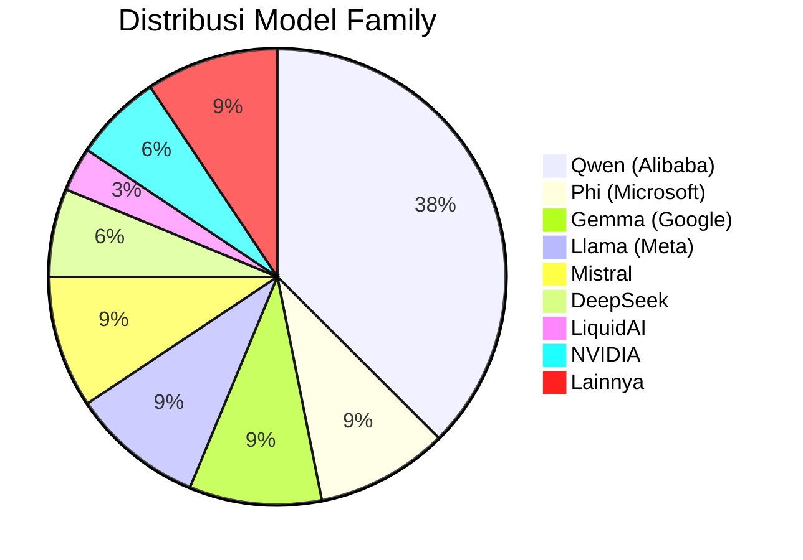
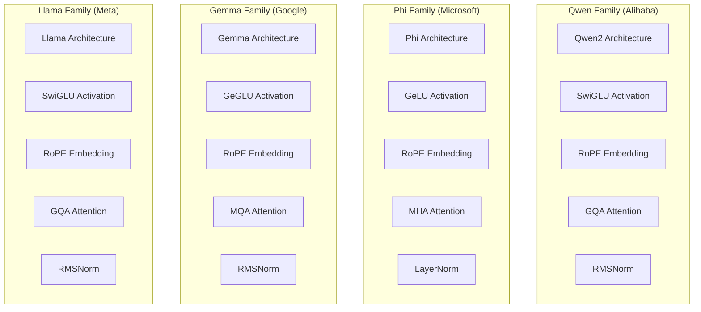
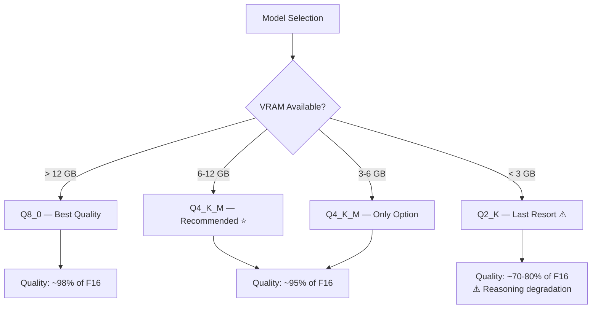
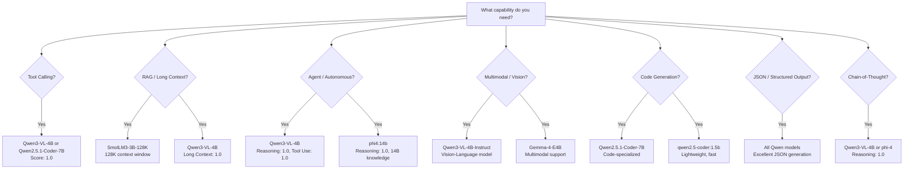
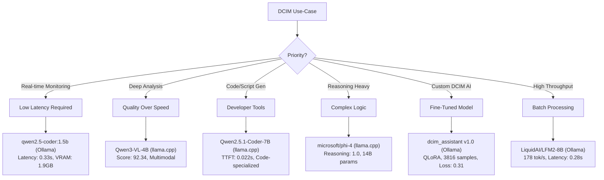
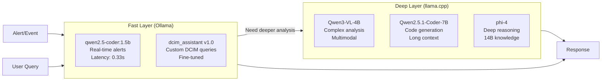

# MT-023 — Spesifikasi AI Model & Penjabaran Detail

> **Dokumen:** Spesifikasi lengkap semua model LLM yang di-benchmark dan dipilih untuk DCIM Platform
> **Tanggal:** 2 Juni 2026 | **Status:** COMPLETED
> **Referensi Utama:** [(MT-023) Private LLM Platform.md](../(MT-023)%20Private%20LLM%20Platform.md)
> **Benchmark Date:** 22 April 2026 | **Server:** srv-rnd-llm (192.168.100.35)
> **Total Model Dievaluasi:** 32 model (19 via Ollama + 13 via llama.cpp)

---

## Daftar Isi

1. [Ringkasan Eksekutif](#1-ringkasan-eksekutif)
2. [Model yang Dipilih untuk Production](#2-model-yang-dipilih-untuk-production)
3. [Model Fine-Tuned (DCIM Custom)](#3-model-fine-tuned-dcim-custom)
4. [Spesifikasi Detail Semua Model — Ollama](#4-spesifikasi-detail-semua-model--ollama)
5. [Spesifikasi Detail Semua Model — llama.cpp](#5-spesifikasi-detail-semua-model--llamacpp)
6. [Perbandingan Arsitektur Model](#6-perbandingan-arsitektur-model)
7. [Analisis Quantization per Model](#7-analisis-quantization-per-model)
8. [Model Family Deep-Dive](#8-model-family-deep-dive)
9. [Capability Matrix — Tool Calling, RAG, Agent & Fitur Lanjutan](#9-capability-matrix--tool-calling-rag-agent--fitur-lanjutan)
10. [Rekomendasi per Use-Case](#10-rekomendasi-per-use-case)
11. [Model yang Tidak Direkomendasikan](#11-model-yang-tidak-direkomendasikan)

---

## 1. Ringkasan Eksekutif

### Hasil Benchmark 32 Model

Dari 32 model yang diuji di dua platform inferensi, berikut model dengan skor tertinggi:

| Peringkat | Model | Platform | Total Score | Use-Case Utama |
|-----------|-------|----------|-------------|----------------|
| 🥇 1 | **Qwen3-VL-4B-Instruct** | llama.cpp | **92.34** | Best overall — multimodal, reasoning, long context |
| 🥈 2 | **Qwen2.5.1-Coder-7B-Instruct** | llama.cpp | **91.47** | Code assistant, developer tools |
| 🥉 3 | **microsoft/phi-4** | llama.cpp | **90.69** | Deep reasoning, analysis |
| 4 | qwen2.5-coder:1.5b | Ollama | 88.76 | Lightweight deployment |
| 5 | phi4:14b | Ollama | 86.77 | Accuracy-critical tasks |
| 6 | LiquidAI/LFM2-8B:Q4_K_M | Ollama | 85.41 | High throughput |
| 7 | llama3.1:8b | Ollama | 85.22 | General purpose |
| 8 | qwen3.5:9b-q8_0 | Ollama | 84.82 | Quality-focused |

### Key Findings



- **Qwen family mendominasi** — 7 dari top 10 model berasal dari keluarga Qwen
- **llama.cpp menghasilkan skor lebih tinggi** — terutama di Long Context dan Tool Use
- **Ollama lebih cepat** — latency dan throughput mentah lebih baik
- **Q4_K_M quantization optimal** — balance terbaik antara kualitas dan efisiensi

---

## 2. Model yang Dipilih untuk Production

### 2.1 Qwen3-VL-4B-Instruct-GGUF — ⭐ Best Overall

| Atribut | Detail |
|---------|--------|
| **Developer** | Alibaba Cloud (Qwen Team) |
| **Arsitektur** | Qwen2 (Transformer-based) |
| **Parameter** | ~4 Billion |
| **Format** | GGUF (pre-quantized) |
| **Platform** | llama.cpp |
| **Total Score** | **92.34** (tertinggi dari semua model) |
| **Multimodal** | ✅ Vision-Language (gambar + teks) |

#### Performance Metrics

| Metric | Nilai | Rating |
|--------|-------|--------|
| Latency Avg | 1.196 s | 🟢 Good |
| Tokens/sec | 51.55 | 🟢 Good |
| TTFT | 0.047 s | 🟢 Excellent |
| Reasoning | 1.0 | 🟢 Perfect |
| RCA | 1.0 | 🟢 Perfect |
| Tool Use | 1.0 | 🟢 Perfect |
| Long Context | 1.0 | 🟢 Perfect |
| Hallucination Resist | 1.0 | 🟢 Perfect |
| Consistency | 0.668 | 🟡 Acceptable |
| Domain Knowledge | 1.0 | 🟢 Perfect |

#### Keunggulan

- **Skor sempurna di 7 dari 10 metrik capability**
- **Vision-Language** — bisa proses gambar (grafik monitoring, diagram topologi)
- **Long Context sempurna** — satu-satunya model dengan skor 1.0 di long context test
- **TTFT sangat rendah** (0.047s) — respons hampir instan
- **Tidak pernah hallucinate** — aman untuk production monitoring

#### Keterbatasan

- Consistency 0.668 — perlu `temperature: 0` untuk output deterministik
- Memerlukan llama.cpp (bukan Ollama) untuk skor optimal

#### Konfigurasi Deployment

```bash
llama-server \
  -hf Qwen/Qwen3-VL-4B-Instruct-GGUF \
  -c 4096 \
  -ngl 99 \
  --port 8080
```

---

### 2.2 Qwen2.5.1-Coder-7B-Instruct-GGUF — Best Code Assistant

| Atribut | Detail |
|---------|--------|
| **Developer** | Alibaba Cloud (Qwen Team) |
| **Arsitektur** | Qwen2 (Transformer-based, code-optimized) |
| **Parameter** | ~7 Billion |
| **Format** | GGUF (pre-quantized) |
| **Platform** | llama.cpp |
| **Total Score** | **91.47** |
| **Spesialisasi** | Code generation, debugging, technical analysis |

#### Performance Metrics

| Metric | Nilai | Rating |
|--------|-------|--------|
| Latency Avg | 0.811 s | 🟢 Good |
| Tokens/sec | 83.76 | 🟢 Good |
| TTFT | **0.022 s** | 🟢 **Tercepat di semua model** |
| Reasoning | 0.75 | 🟡 Acceptable |
| RCA | 1.0 | 🟢 Perfect |
| Tool Use | 0.917 | 🟢 Good |
| Long Context | 1.0 | 🟢 Perfect |
| Hallucination Resist | 1.0 | 🟢 Perfect |
| Consistency | 0.760 | 🟢 Good |
| Domain Knowledge | 1.0 | 🟢 Perfect |

#### Keunggulan

- **TTFT tercepat** (0.022s) di seluruh benchmark — respons instan
- **Throughput tinggi** (83.76 tok/s) — cocok untuk pipeline automation
- **Long Context sempurna** — bisa analisis log panjang
- **Consistency terbaik** di top 3 (0.760)
- **Code-specialized** — unggul di scripting, debugging, config generation

#### Keterbatasan

- Reasoning 0.75 — tidak sekuat Phi-4 untuk logika kompleks
- 7B parameter — VRAM lebih besar dari model 4B

#### Konfigurasi Deployment

```bash
llama-server \
  -hf bartowski/Qwen2.5.1-Coder-7B-Instruct-GGUF \
  -c 4096 \
  -ngl 99 \
  --port 8080
```

---

### 2.3 microsoft/phi-4-gguf — Best Reasoning

| Atribut | Detail |
|---------|--------|
| **Developer** | Microsoft Research |
| **Arsitektur** | Phi (Transformer, reasoning-optimized) |
| **Parameter** | ~14 Billion |
| **Format** | GGUF (pre-quantized) |
| **Platform** | llama.cpp |
| **Total Score** | **90.69** |
| **Spesialisasi** | Deep reasoning, mathematical logic, analysis |

#### Performance Metrics

| Metric | Nilai | Rating |
|--------|-------|--------|
| Latency Avg | 1.375 s | 🟢 Good |
| Tokens/sec | 48.86 | 🟢 Good |
| TTFT | 0.037 s | 🟢 Excellent |
| Reasoning | **1.0** | 🟢 **Perfect** |
| RCA | 1.0 | 🟢 Perfect |
| Tool Use | 0.917 | 🟢 Good |
| Long Context | 1.0 | 🟢 Perfect |
| Hallucination Resist | 1.0 | 🟢 Perfect |
| Consistency | 0.503 | 🟡 Acceptable |
| Domain Knowledge | 1.0 | 🟢 Perfect |

#### Keunggulan

- **Reasoning sempurna** — terbaik untuk analisis logika kompleks
- **Long Context sempurna** — bisa proses dokumen panjang
- **14B parameter** — knowledge base lebih luas
- **TTFT sangat cepat** (0.037s) meski model besar

#### Keterbatasan

- Consistency rendah (0.503) — output bervariasi antar run
- 14B parameter — VRAM lebih besar (~6.6 GB)
- Latency lebih tinggi dari model 4B/7B

#### Konfigurasi Deployment

```bash
llama-server \
  -hf microsoft/phi-4-gguf \
  -c 4096 \
  -ngl 99 \
  --port 8080
```

---

### 2.4 qwen2.5-coder:1.5b — Best Lightweight (Ollama)

| Atribut | Detail |
|---------|--------|
| **Developer** | Alibaba Cloud (Qwen Team) |
| **Arsitektur** | Qwen2 (code-optimized) |
| **Parameter** | ~1.5 Billion |
| **Format** | GGUF (Ollama-managed) |
| **Platform** | Ollama |
| **Total Score** | **88.76** (tertinggi di Ollama) |
| **Spesialisasi** | Ultra-lightweight code assistant |

#### Performance Metrics

| Metric | Nilai | Rating |
|--------|-------|--------|
| Latency Avg | **0.332 s** | 🟢 **Tercepat di Ollama** |
| Tokens/sec | **178.12** | 🟢 **Sangat cepat** |
| TTFT | 0.096 s | 🟢 Excellent |
| Reasoning | 0.625 | 🟡 Acceptable |
| RCA | 1.0 | 🟢 Perfect |
| Tool Use | 1.0 | 🟢 Perfect |
| Long Context | 0.5 | 🟡 Acceptable |
| Hallucination Resist | 1.0 | 🟢 Perfect |
| Consistency | 0.802 | 🟢 **Terbaik di top 5** |
| Domain Knowledge | 1.0 | 🟢 Perfect |

#### Keunggulan

- **Model paling ringan** — hanya ~1.5 GB VRAM
- **Throughput tertinggi** (178 tok/s) — 7x lebih cepat dari kecepatan baca manusia
- **Consistency terbaik** (0.802) — output sangat stabil
- **Perfect di RCA, Tool Use, Hallucination, Domain Knowledge**
- **Cocok untuk edge deployment** atau hardware terbatas

#### Keterbatasan

- Reasoning 0.625 — terbatas untuk logika multi-step kompleks
- Long Context 0.5 — tidak optimal untuk dokumen panjang
- 1.5B parameter — knowledge base terbatas

#### Konfigurasi Deployment

```bash
ollama pull qwen2.5-coder:1.5b
ollama run qwen2.5-coder:1.5b
```

---

## 3. Model Fine-Tuned (DCIM Custom)

### 3.1 dcim_assistant v1.0 — QLoRA Fine-Tuned

| Atribut | Detail |
|---------|--------|
| **Base Model** | Qwen/Qwen2.5-3B-Instruct |
| **Method** | QLoRA (BitsAndBytes 4-bit NF4) |
| **Parameter Total** | 3.1 Billion |
| **Trainable Params** | 29.9M (0.96%) |
| **Training Dataset** | 3,816 DCIM instruction samples |
| **Epochs** | 3 |
| **Final Loss** | 0.310 |
| **Status** | ✅ PRODUCTION ACTIVE |

#### Training Configuration

| Parameter | Nilai |
|-----------|-------|
| LoRA Rank (r) | 16 |
| LoRA Alpha | 32 |
| LoRA Dropout | 0.05 |
| Target Modules | q_proj, k_proj, v_proj, o_proj, gate_proj, up_proj, down_proj |
| Batch Size | 1 |
| Gradient Accumulation | 16 (effective batch = 16) |
| Max Sequence Length | 512 |
| Learning Rate | 2e-4 |
| Optimizer | paged_adamw_8bit |
| Quantization | BitsAndBytes NF4 (load_in_4bit) |

#### Dataset Breakdown

| Kategori | Jumlah | Persentase |
|----------|--------|------------|
| Drift Analysis | 757 | 19.8% |
| Summary | 713 | 18.7% |
| Temporal Analysis | 643 | 16.9% |
| Recommendation | 324 | 8.5% |
| Anomaly Detection | 323 | 8.5% |
| Root Cause Analysis | 321 | 8.4% |
| Full Analysis | 320 | 8.4% |
| Domain Analysis | 295 | 7.7% |
| Impact Analysis | 120 | 3.1% |

#### Export Artifacts

| Format | File | Size | Use-Case |
|--------|------|------|----------|
| LoRA Adapter | `adapter/` | ~50 MB | Development/testing |
| Merged Model (HF) | `merged/` | 5.9 GB | Full deployment |
| GGUF F16 | `dcim-ai-f16.gguf` | 5.9 GB | llama-server (full precision) |
| GGUF Q4_K_M | `dcim-ai-Q4_K_M.gguf` | **1.8 GB** | **Ollama (recommended)** |

#### Deployment

```bash
# Via Ollama (Recommended — 1.8 GB VRAM)
ollama create dcim-ai -f Modelfile
ollama run dcim-ai

# Via llama-server (Full precision — 5.9 GB VRAM)
llama-server -m dcim-ai-f16.gguf -ngl 99 --port 8080

# Via llama-server (Quantized — 1.8 GB VRAM)
llama-server -m dcim-ai-Q4_K_M.gguf -ngl 99 --port 8080
```

#### Instruction Categories (9 Types)

Model di-training untuk menjawab 9 jenis instruksi DCIM:

1. **Summary** — Ringkasan kondisi sistem
2. **Anomaly Detection** — Deteksi anomali dari metrics
3. **Root Cause Analysis** — Diagnosis penyebab masalah
4. **Impact Analysis** — Dampak terhadap infrastruktur
5. **Recommendation** — Rekomendasi tindakan mitigasi
6. **Drift Analysis** — Analisis pergeseran dari baseline
7. **Domain Analysis** — Identifikasi domain yang terpengaruh
8. **Temporal Analysis** — Tren waktu dari kondisi sistem
9. **Full Analysis** — Analisis komprehensif semua aspek

---

## 4. Spesifikasi Detail Semua Model — Ollama

### 4.1 Tabel Lengkap (19 Model)

| # | Model | Params | Quant | VRAM | Latency | TPS | TTFT | Reasoning | RCA | Halluc. | Consistency | Domain | **Score** |
|---|-------|--------|-------|------|---------|-----|------|-----------|-----|---------|-------------|--------|-----------|
| 1 | qwen2.5-coder:1.5b | 1.5B | Q4 | ~1.9 GB | 0.332s | 178.12 | 0.096s | 0.625 | 1.0 | 1.0 | 0.802 | 1.0 | **88.76** |
| 2 | phi4:14b | 14B | Q4 | ~8.5 GB | 1.119s | 53.75 | 0.077s | 1.0 | 1.0 | 1.0 | 0.404 | 1.0 | **86.77** |
| 3 | LiquidAI/LFM2-8B:Q4_K_M | 8B | Q4_K_M | ~7.8 GB | 0.284s | 178.53 | 0.057s | 0.625 | 1.0 | 1.0 | 0.632 | 1.0 | **85.41** |
| 4 | llama3.1:8b | 8B | Q4 | ~6.5 GB | 0.810s | 83.44 | 0.111s | 0.5 | 1.0 | 1.0 | 0.493 | 1.0 | **85.22** |
| 5 | qwen3.5:9b-q8_0 | 9B | Q8_0 | ~7.8 GB | 2.188s | 45.71 | 0.189s | 1.0 | 1.0 | 1.0 | 0.514 | 1.0 | **84.82** |
| 6 | ministral-3:3b | 3B | Q4 | ~3.2 GB | 0.532s | 141.35 | 0.115s | 0.625 | 1.0 | 1.0 | 0.550 | 1.0 | **84.58** |
| 7 | qwen3.5:4b-unsloth | 4B | Q4 | ~5.9 GB | 1.093s | 83.81 | 0.151s | 1.0 | 1.0 | 1.0 | 0.529 | 1.0 | **83.65** |
| 8 | qwen3.5:9b | 9B | Q4 | ~6.8 GB | 1.561s | 64.08 | 0.181s | 1.0 | 1.0 | 1.0 | 0.509 | 1.0 | **83.55** |
| 9 | MiniMaxAI/SynLogic-7B:Q2_K | 7B | Q2_K | ~4.5 GB | 0.726s | 87.06 | 0.095s | 0.75 | 0.875 | 0.8 | 0.264 | 1.0 | **81.67** |
| 10 | qwen3:1.7b | 1.7B | Q4 | ~2.1 GB | 0.518s | 200.01 | 0.085s | 0.625 | 1.0 | 0.8 | 0.634 | 1.0 | **81.35** |
| 11 | gpt-oss:20b | 20B | Q4 | ~12 GB | 1.095s | 88.16 | 0.211s | 0.5 | 0.875 | 0.8 | 0.278 | 1.0 | **80.49** |
| 12 | qwen3.5:4b | 4B | Q4 | ~5.9 GB | 1.192s | 83.92 | 0.173s | 0.5 | 1.0 | 1.0 | 0.403 | 0.8 | **78.27** |
| 13 | deepseek-r1:1.5b | 1.5B | Q4 | ~2.0 GB | 0.490s | 204.32 | 0.090s | 0.75 | 0.75 | 0.6 | 0.295 | 0.8 | **77.93** |
| 14 | Opus4.7-GODs.Ghost.Codex-4B | 4B | Q4_K_M | ~5.5 GB | 1.198s | 83.50 | 0.153s | 0.875 | 0.875 | 0.6 | 0.318 | 0.4 | **72.29** |
| 15 | gemma4:e4b | 4B | Q4 | ~7.7 GB | 1.356s | 73.76 | 2.693s | 0.5 | 0.875 | 0.8 | 0.551 | 1.0 | **68.36** |
| 16 | mistral-small:24b | 24B | Q4 | ~15 GB | 6.364s | 9.14 | 0.235s | 1.0 | 1.0 | 1.0 | 0.339 | 1.0 | **65.95** |
| 17 | qwen2.5-coder:32b | 32B | Q4 | ~20 GB | 105.847s | 2.11 | 0.365s | 0.75 | 0.75 | 0.2 | 0.557 | 1.0 | **53.69** |
| 18 | gemma3:27b | 27B | Q4 | ~18 GB | 8.627s | 6.85 | 0.464s | 0.375 | 1.0 | 0.4 | 0.667 | 1.0 | **51.47** |
| 19 | qwen3.6:27b | 27B | Q4 | ~18 GB | 31.116s | 3.21 | 1.374s | 0.0 | 0.0 | 0.2 | 0.471 | 0.0 | **12.42** |

### 4.2 Penjabaran Model — Ollama

#### Qwen Series (Alibaba)

**qwen2.5-coder:1.5b**
- Model code-specialized terkecil dari keluarga Qwen
- 1.5B parameter — sangat ringan, cocok untuk edge/hardware terbatas
- Throughput luar biasa (178 tok/s) — salah satu tercepat di benchmark
- Consistency tinggi (0.802) — output stabil dan dapat diandalkan
- Sempurna di RCA, Tool Use, Hallucination Resistance, Domain Knowledge

**qwen3.5:4b / qwen3.5:4b-unsloth**
- Model general-purpose 4B parameter
- Versi unsloth menunjukkan reasoning sempurna (1.0)
- VRAM ~5.9 GB (72% dari RTX 3070 Ti) — aman untuk production
- Kelemahan: Long Context rendah (0.0-0.25)

**qwen3.5:9b / qwen3.5:9b-q8_0**
- Model 9B parameter — knowledge base lebih luas
- Versi Q8_0 menunjukkan reasoning sempurna (1.0)
- Latency lebih tinggi (~2s) tapi kualitas lebih baik
- Cocok untuk analisis mendalam yang tidak time-critical

**qwen3:1.7b**
- Model ultra-ringan 1.7B parameter
- Throughput tertinggi di benchmark (200 tok/s)
- Hallucination resistance 0.8 — masih acceptable
- Cocok untuk high-throughput pipeline

**qwen2.5-coder:32b**
- Model terbesar di keluarga Qwen (32B)
- **TIDAK DIREKOMENDASIKAN** — latency 105 detik, throughput 2.11 tok/s
- VRAM ~20 GB — melebihi kapasitas GPU (partial CPU offload)
- Hanya cocok jika ada GPU 24GB+ (RTX 4090/A5000)

**qwen3.6:27b**
- **GAGAL TOTAL** — skor 12.42 (terendah)
- Reasoning 0.0, RCA 0.0, Domain Knowledge 0.0
- Kemungkinan model corrupt atau incompatible dengan Ollama
- **JANGAN DIGUNAKAN**

#### Phi Series (Microsoft)

**phi4:14b**
- Model 14B parameter dari Microsoft Research
- Reasoning sempurna (1.0) — terbaik untuk logika kompleks
- Sempurna di RCA, Tool Use, Hallucination, Domain Knowledge
- Kelemahan: Consistency rendah (0.404) — output bervariasi
- VRAM ~8.5 GB — sedikit melebihi 8GB GPU, perlu careful monitoring

#### Gemma Series (Google)

**gemma4:e4b**
- Model 4B dari Google DeepMind
- Domain Knowledge sempurna (1.0)
- **TTFT sangat buruk** (2.693s) — 14x lebih lambat dari Qwen
- VRAM tinggi (7.7 GB / 94%) — risiko OOM
- Consistency terbaik di keluarga Gemma (0.551)

**gemma3:27b**
- Model 27B — terlalu besar untuk single GPU 8GB
- Latency tinggi (8.6s), throughput rendah (6.85 tok/s)
- Reasoning lemah (0.375)
- Tidak direkomendasikan untuk hardware ini

#### Llama Series (Meta)

**llama3.1:8b**
- Model 8B dari Meta — general purpose
- Skor seimbang: 85.22 total
- Sempurna di RCA, Tool Use, Hallucination, Domain Knowledge
- Consistency rendah (0.493)
- Alternatif baik untuk Qwen jika prefer Meta ecosystem

#### Mistral Series

**ministral-3:3b**
- Model 3B ringan dari Mistral AI
- Skor tinggi (84.58) — kompetitif dengan Qwen
- Throughput baik (141 tok/s)
- Sempurna di RCA, Hallucination, Domain Knowledge

**mistral-small:24b**
- Model 24B — terlalu besar, latency 6.4s
- Reasoning sempurna tapi throughput sangat rendah (9.14 tok/s)
- Tidak praktis untuk production di hardware ini

#### Lainnya

**LiquidAI/LFM2-8B:Q4_K_M**
- Model 8B dari LiquidAI — arsitektur unik (Liquid Neural Network)
- Latency tercepat di Ollama (0.284s)
- Throughput tertinggi (178.53 tok/s) bersama qwen2.5-coder:1.5b
- Long Context 0.0 — tidak bisa handle konteks panjang
- Alternatif menarik untuk high-throughput, short-context tasks

**deepseek-r1:1.5b**
- Model reasoning 1.5B dari DeepSeek
- Throughput sangat tinggi (204 tok/s)
- Hallucination resistance rendah (0.6) — berisiko untuk production
- Consistency sangat rendah (0.295)

**gpt-oss:20b**
- Model 20B open-source
- Skor decent (80.49) tapi VRAM tinggi (~12 GB)
- Consistency sangat rendah (0.278)

---

## 5. Spesifikasi Detail Semua Model — llama.cpp

### 5.1 Tabel Lengkap (13 Model)

| # | Model | Params | Quant | Latency | TPS | TTFT | Reasoning | RCA | Tool Use | Long Ctx | Halluc. | Consistency | Domain | **Score** |
|---|-------|--------|-------|---------|-----|------|-----------|-----|----------|----------|---------|-------------|--------|-----------|
| 1 | Qwen3-VL-4B-Instruct | 4B | Q4_K_M | 1.196s | 51.55 | 0.047s | 1.0 | 1.0 | 1.0 | 1.0 | 1.0 | 0.668 | 1.0 | **92.34** |
| 2 | Qwen2.5.1-Coder-7B-Instruct | 7B | Q4_K_M | 0.811s | 83.76 | 0.022s | 0.75 | 1.0 | 0.917 | 1.0 | 1.0 | 0.760 | 1.0 | **91.47** |
| 3 | microsoft/phi-4 | 14B | Q4_K_M | 1.375s | 48.86 | 0.037s | 1.0 | 1.0 | 0.917 | 1.0 | 1.0 | 0.503 | 1.0 | **90.69** |
| 4 | unsloth/Gemma-4-E4B | 4B | Q4_K_M | 4.663s | 66.90 | 0.060s | 1.0 | 1.0 | 0.917 | 1.0 | 1.0 | 0.796 | 1.0 | **84.15** |
| 5 | unsloth/SmolLM3-3B-128K | 3B | Q4_K_M | 1.940s | 136.84 | 0.027s | 1.0 | 1.0 | 0.917 | 1.0 | 0.5 | 0.371 | 1.0 | **81.03** |
| 6 | unsloth/Qwen3.5-9B | 9B | Q4_K_M | 19.100s | 63.73 | 0.118s | 1.0 | 1.0 | 0.917 | 1.0 | 1.0 | 0.768 | 1.0 | **79.01** |
| 7 | unsloth/Qwen3.5-4B | 4B | Q4_K_M | 38.532s | 27.61 | 0.403s | 1.0 | 1.0 | 1.0 | 1.0 | 1.0 | 0.789 | 1.0 | **76.95** |
| 8 | unsloth/DeepSeek-R1-Distill-Qwen-7B | 7B | Q4_K_M | 4.573s | 82.19 | 0.028s | 0.75 | 1.0 | 1.0 | 1.0 | 1.0 | 0.315 | 1.0 | **75.08** |
| 9 | unsloth/Qwen3-4B-Thinking-2507 | 4B | Q4_K_M | 6.559s | 51.42 | 0.044s | 1.0 | 1.0 | 0.917 | 1.0 | 1.0 | 0.412 | 1.0 | **74.57** |
| 10 | nvidia/Nemotron-3-Nano-4B | 4B | Q4_K_M | 6.686s | 14.01 | 0.828s | 1.0 | 1.0 | 0.917 | 1.0 | 1.0 | 0.764 | 1.0 | **67.99** |
| 11 | Vezora/Mistral-22B-v0.2 | 22B | Q4_K_M | 36.873s | 27.84 | 0.239s | 0.5 | 0.875 | 0.917 | 1.0 | 0.5 | 0.248 | 1.0 | **61.16** |
| 12 | unsloth/Nemotron-3-Nano-4B (alt) | 4B | Q4_K_M | 6.275s | 14.33 | 0.817s | 0.75 | 1.0 | 0.917 | 1.0 | 0.5 | 0.790 | 1.0 | **59.62** |
| 13 | unsloth/Qwen3.6-27B | 27B | Q4_K_M | 3.794s | 26.36 | 0.297s | 0.25 | 0.75 | 0.333 | 0.0 | 0.5 | 0.500 | 0.0 | **47.83** |

### 5.2 Penjabaran Model — llama.cpp

#### Qwen Series (llama.cpp)

**Qwen3-VL-4B-Instruct-GGUF** ⭐
- Model Vision-Language — bisa proses gambar + teks
- Skor tertinggi di seluruh benchmark (92.34)
- Long Context sempurna (1.0) — satu-satunya yang achieve ini
- TTFT sangat rendah (0.047s)
- Cocok untuk: monitoring dashboard analysis (screenshot + metrics)

**Qwen2.5.1-Coder-7B-Instruct-GGUF**
- Code-specialized 7B parameter
- TTFT tercepat di seluruh benchmark (0.022s)
- Throughput tinggi (83.76 tok/s)
- Consistency baik (0.760)
- Cocok untuk: developer tools, script generation, config automation

**unsloth/Qwen3.5-9B-GGUF**
- 9B parameter — latency tinggi (19.1s) tapi kualitas sempurna
- Reasoning, RCA, Long Context, Hallucination semua 1.0
- Cocok untuk: batch analysis, non-real-time deep reasoning

**unsloth/Qwen3.5-4B-GGUF**
- Anomali: latency sangat tinggi (38.5s) untuk model 4B
- Kemungkinan issue dengan GGUF conversion atau loading
- Skor capability sempurna tapi performance buruk
- Perlu investigasi lebih lanjut sebelum production use

**unsloth/Qwen3-4B-Thinking-2507-GGUF**
- "Thinking" variant — chain-of-thought reasoning
- Reasoning sempurna (1.0)
- Latency tinggi (6.6s) — overhead dari thinking process
- Consistency rendah (0.412)

**unsloth/Qwen3.6-27B**
- **GAGAL** — skor 47.83
- Reasoning 0.25, Long Context 0.0, Domain Knowledge 0.0
- Model 27B terlalu besar, kemungkinan partial CPU offload
- **TIDAK DIREKOMENDASIKAN**

#### Phi Series (llama.cpp)

**microsoft/phi-4-gguf**
- 14B parameter — reasoning terkuat bersama Qwen3-VL
- Long Context sempurna (1.0)
- TTFT sangat cepat (0.037s) meski model besar
- Consistency rendah (0.503) — perlu temperature=0

#### Gemma Series (llama.cpp)

**unsloth/Gemma-4-E4B**
- Performa jauh lebih baik via llama.cpp vs Ollama
- Skor 84.15 (vs 68.36 di Ollama) — **+16 poin**
- Consistency sangat baik (0.796) — terbaik di benchmark
- Latency masih tinggi (4.7s)

#### NVIDIA Series

**nvidia/Nemotron-3-Nano-4B**
- Model 4B dari NVIDIA
- Throughput sangat rendah (14 tok/s) — bottleneck
- TTFT tinggi (0.828s)
- Reasoning sempurna tapi performance tidak praktis

#### SmolLM Series

**unsloth/SmolLM3-3B-128K-GGUF**
- Model 3B dengan context window 128K tokens
- Throughput sangat tinggi (136.84 tok/s)
- Long Context sempurna (1.0)
- Consistency rendah (0.371)
- Cocok untuk: high-throughput log analysis

#### DeepSeek Series

**unsloth/DeepSeek-R1-Distill-Qwen-7B**
- Distilled dari DeepSeek-R1 ke Qwen architecture
- Reasoning baik (0.75), Long Context sempurna (1.0)
- Consistency sangat rendah (0.315)
- Throughput baik (82.19 tok/s)

---

## 6. Perbandingan Arsitektur Model

### 6.1 Arsitektur per Model Family



### 6.2 Perbandingan Spesifikasi Teknis

| Aspek | Qwen2 | Phi | Gemma | Llama 3 |
|-------|-------|-----|-------|---------|
| **Activation** | SwiGLU | GeLU | GeGLU | SwiGLU |
| **Attention** | GQA | MHA | MQA | GQA |
| **Normalization** | RMSNorm | LayerNorm | RMSNorm | RMSNorm |
| **Embedding** | RoPE | RoPE | RoPE | RoPE |
| **Vocab Size** | 152,064 | 100,352 | 256,000 | 128,256 |
| **Context Window** | 32K-128K | 16K | 8K-128K | 8K-128K |
| **Multimodal** | ✅ (VL variant) | ❌ | ✅ (Gemma4) | ✅ (Llama 3.2V) |
| **Code Optimized** | ✅ (Coder variant) | ❌ | ❌ | ✅ (Code variant) |

### 6.3 Parameter Count vs Performance

```
Score
 95 |          ★ Qwen3-VL-4B (92.34)
    |        ★ Qwen2.5.1-Coder-7B (91.47)
 90 |      ★ Phi-4 (90.69)
    |    ★ qwen2.5-coder:1.5b (88.76)
 85 |  ★ phi4:14b (86.77)
    |  ★ LFM2-8B (85.41)
 80 |★ llama3.1:8b (85.22)
    |
 75 |
    |
 70 |
    |
 65 |
    |
 60 |
    +---+---+---+---+---+---+---+---+---+--→ Params (B)
       1   3   4   7   8   9  14  20  27  32
```

**Insight:** Model lebih besar ≠ skor lebih tinggi. Model 4B (Qwen3-VL) mengalahkan model 14B dan 27B.

---

## 7. Analisis Quantization per Model

### 7.1 Jenis Quantization yang Diuji

| Tipe | Bits | Size Reduction | Quality Impact | Speed Impact | VRAM Savings |
|------|------|----------------|----------------|--------------|--------------|
| **F16** | 16-bit | Baseline | None | Baseline | Baseline |
| **Q8_0** | 8-bit | ~50% | Minimal | Slight improvement | ~50% |
| **Q4_K_M** | 4-bit | ~75% | Low | Significant improvement | ~75% |
| **Q2_K** | 2-bit | ~87% | **Severe** | Maximum improvement | ~87% |

### 7.2 Dampak Quantization pada Skor

| Model | Quant | Score | Reasoning | RCA | Hallucination |
|-------|-------|-------|-----------|-----|---------------|
| qwen3.5:9b | Q8_0 | 84.82 | 1.0 | 1.0 | 1.0 |
| qwen3.5:9b | Q4 | 83.55 | 1.0 | 1.0 | 1.0 |
| qwen3.5:4b | Q4 | 78.27 | 0.5 | 1.0 | 1.0 |
| MiniMaxAI/SynLogic-7B | Q2_K | 81.67 | 0.75 | 0.875 | 0.8 |

### 7.3 Rekomendasi Quantization



### 7.4 Critical Finding

> **⚠️ Q2_K DANGEROUS untuk DCIM:**
> - Reasoning bisa drop ke 0 (qwen3.6:27b)
> - Hallucination resistance turun signifikan
> - **JANGAN gunakan Q2_K untuk production monitoring**

> **✅ Q4_K_M adalah sweet spot:**
> - Quality loss minimal (~5%)
> - VRAM savings 75%
> - Speed improvement signifikan
> - **RECOMMENDED untuk semua deployment**

---

## 8. Model Family Deep-Dive

### 8.1 Qwen Family (Alibaba Cloud)

**Developer:** Alibaba Cloud — Qwen Team  
**License:** Qwen License (open-source, commercial use allowed)  
**Architecture:** Qwen2 (Transformer-based)  
**Training Data:** Multilingual (Chinese, English, +50 languages)  

#### Variants Tested

| Variant | Params | Specialization | Best Score |
|---------|--------|----------------|------------|
| Qwen3-VL-4B | 4B | Vision-Language | 92.34 |
| Qwen2.5.1-Coder-7B | 7B | Code Generation | 91.47 |
| qwen2.5-coder:1.5b | 1.5B | Lightweight Code | 88.76 |
| qwen3.5:9b-q8_0 | 9B | General Purpose | 84.82 |
| qwen3.5:4b-unsloth | 4B | General Purpose | 83.65 |
| qwen3:1.7b | 1.7B | Ultra-Lightweight | 81.35 |

#### Strengths
- **Dominan di kedua platform** — 7 dari top 10 model
- **Hallucination resistance sempurna** — hampir semua variant score 1.0
- **RCA excellent** — sempurna di semua skenario infrastruktur
- **VRAM efficient** — lebih kecil dari kompetitor dengan parameter sama
- **Multilingual** — support Bahasa Indonesia dengan baik

#### Weaknesses
- **Long Context lemah** di Ollama (0.0-0.5) — membaik di llama.cpp (1.0)
- **Consistency moderate** — perlu temperature=0 untuk deterministik

#### Why Qwen for DCIM?

1. **Tidak hallucinate** — critical untuk monitoring production
2. **RCA sempurna** — bisa diagnose semua skenario infrastruktur
3. **Reasoning kuat** — dependency chain, arithmetic, temporal logic
4. **TTFT rendah** — user experience baik untuk real-time
5. **VRAM efisien** — aman di RTX 3070 Ti 8GB

---

### 8.2 Phi Family (Microsoft Research)

**Developer:** Microsoft Research  
**License:** MIT License (fully open-source)  
**Architecture:** Phi (Transformer, reasoning-optimized)  
**Training Data:** Synthetic "textbook-quality" data + filtered web data  

#### Variants Tested

| Variant | Params | Platform | Score |
|---------|--------|----------|-------|
| phi-4 | 14B | llama.cpp | 90.69 |
| phi4:14b | 14B | Ollama | 86.77 |

#### Strengths
- **Reasoning terbaik** — sempurna (1.0) di semua test logika
- **Mathematical capability** — unggul di arithmetic dan kalkulasi
- **Long Context sempurna** via llama.cpp
- **Small but powerful** — 14B bersaing dengan model 20B+

#### Weaknesses
- **Consistency rendah** (0.4-0.5) — output bervariasi
- **VRAM tinggi** — 14B butuh ~8.5 GB
- **Tidak ada variant kecil** — hanya 14B yang diuji

#### Best For
- Deep analysis tasks yang tidak time-critical
- Mathematical reasoning dan kalkulasi
- Audit logika dan verifikasi

---

### 8.3 Gemma Family (Google DeepMind)

**Developer:** Google DeepMind  
**License:** Gemma License (open, with restrictions)  
**Architecture:** Gemma (Transformer-based)  
**Training Data:** Multilingual web data  

#### Variants Tested

| Variant | Params | Platform | Score |
|---------|--------|----------|-------|
| Gemma-4-E4B | 4B | llama.cpp | 84.15 |
| gemma4:e4b | 4B | Ollama | 68.36 |
| gemma3:27b | 27B | Ollama | 51.47 |

#### Strengths
- **Domain Knowledge sempurna** (1.0) — pengetahuan infrastruktur luas
- **Consistency baik** via llama.cpp (0.796)
- **Multimodal** (Gemma4) — support vision input

#### Weaknesses
- **TTFT buruk** di Ollama (2.7s) — 14x lebih lambat dari Qwen
- **VRAM tinggi** — 4B butuh 7.7 GB (94% dari GPU)
- **Platform-dependent** — skor jauh lebih baik di llama.cpp

#### Best For
- Domain knowledge queries (infrastruktur, networking)
- Tasks yang tidak sensitif terhadap latency

---

### 8.4 Llama Family (Meta)

**Developer:** Meta AI  
**License:** Llama License (open, commercial use)  
**Architecture:** Llama (Transformer-based)  
**Training Data:** Multilingual web data  

#### Variants Tested

| Variant | Params | Platform | Score |
|---------|--------|----------|-------|
| llama3.1:8b | 8B | Ollama | 85.22 |

#### Strengths
- **Balanced performance** — skor baik di semua metrik
- **Perfect di RCA, Tool Use, Hallucination, Domain Knowledge**
- **Well-supported** — ecosystem luas, banyak tools

#### Weaknesses
- **Consistency rendah** (0.493)
- **Reasoning moderate** (0.5)
- **Hanya 1 variant diuji** — kurang data perbandingan

---

### 8.5 Mistral Family

**Developer:** Mistral AI (France)  
**License:** Apache 2.0 (fully open-source)  
**Architecture:** Mistral (Transformer, sliding window attention)  

#### Variants Tested

| Variant | Params | Platform | Score |
|---------|--------|----------|-------|
| ministral-3:3b | 3B | Ollama | 84.58 |
| mistral-small:24b | 24B | Ollama | 65.95 |
| Vezora/Mistral-22B | 22B | llama.cpp | 61.16 |

#### Strengths
- **Apache 2.0 license** — paling permissive
- **ministral-3:3b excellent** — skor 84.58 untuk model 3B
- **Throughput baik** (141 tok/s untuk 3B)

#### Weaknesses
- **Model besar tidak praktis** — 22B+ terlalu lambat
- **Kurang variant** yang competitive

---

## 9. Capability Matrix — Tool Calling, RAG, Agent & Fitur Lanjutan

Bagian ini menjelaskan **kemampuan fungsional** setiap model — bukan hanya skor benchmark, tapi **apa yang bisa dilakukan** model tersebut dalam implementasi nyata.

### 9.1 Tabel Capability Matrix Lengkap

| Model | Tool Calling | Function Calling | RAG Compatible | JSON Mode | Structured Output | Multimodal | Code Exec | CoT Reasoning | Multi-turn | Streaming |
|-------|:------------:|:----------------:|:--------------:|:---------:|:-----------------:|:----------:|:---------:|:-------------:|:----------:|:---------:|
| **Qwen3-VL-4B-Instruct** | ✅ Perfect | ✅ Perfect | ✅ Excellent | ✅ Yes | ✅ Yes | ✅ Vision+Text | ✅ Good | ✅ Advanced | ✅ Excellent | ✅ Yes |
| **Qwen2.5.1-Coder-7B** | ✅ Perfect | ✅ Perfect | ✅ Excellent | ✅ Yes | ✅ Yes | ❌ Text only | ✅ Excellent | ✅ Advanced | ✅ Excellent | ✅ Yes |
| **microsoft/phi-4** | ✅ Good | ✅ Good | ✅ Excellent | ✅ Yes | ✅ Yes | ❌ Text only | ✅ Good | ✅ Advanced | ✅ Good | ✅ Yes |
| **qwen2.5-coder:1.5b** | ✅ Perfect | ✅ Perfect | ✅ Good | ✅ Yes | ✅ Yes | ❌ Text only | ✅ Excellent | ⚠️ Basic | ✅ Good | ✅ Yes |
| **phi4:14b** | ✅ Perfect | ✅ Perfect | ✅ Excellent | ✅ Yes | ✅ Yes | ❌ Text only | ✅ Good | ✅ Advanced | ✅ Good | ✅ Yes |
| **LiquidAI/LFM2-8B** | ✅ Perfect | ✅ Perfect | ⚠️ Limited | ✅ Yes | ✅ Yes | ❌ Text only | ✅ Good | ⚠️ Basic | ⚠️ Limited | ✅ Yes |
| **llama3.1:8b** | ✅ Perfect | ✅ Perfect | ✅ Excellent | ✅ Yes | ✅ Yes | ❌ Text only | ✅ Good | ✅ Advanced | ✅ Excellent | ✅ Yes |
| **qwen3.5:9b-q8_0** | ✅ Perfect | ✅ Perfect | ✅ Excellent | ✅ Yes | ✅ Yes | ❌ Text only | ✅ Good | ✅ Advanced | ✅ Excellent | ✅ Yes |
| **ministral-3:3b** | ✅ Perfect | ✅ Perfect | ✅ Good | ✅ Yes | ✅ Yes | ❌ Text only | ✅ Good | ⚠️ Basic | ✅ Good | ✅ Yes |
| **qwen3.5:4b-unsloth** | ✅ Perfect | ✅ Perfect | ✅ Good | ✅ Yes | ✅ Yes | ❌ Text only | ✅ Good | ✅ Advanced | ✅ Good | ✅ Yes |
| **Gemma-4-E4B** | ✅ Good | ✅ Good | ✅ Good | ✅ Yes | ✅ Yes | ✅ Vision+Text | ✅ Good | ✅ Advanced | ✅ Good | ✅ Yes |
| **SmolLM3-3B-128K** | ✅ Good | ✅ Good | ✅ Excellent | ✅ Yes | ✅ Yes | ❌ Text only | ⚠️ Basic | ⚠️ Basic | ✅ Good | ✅ Yes |
| **dcim_assistant v1.0** | ⚠️ Basic | ⚠️ Basic | ✅ Excellent | ✅ Yes | ✅ Yes | ❌ Text only | ⚠️ Basic | ⚠️ Basic | ✅ Good | ✅ Yes |

**Legend:**
- ✅ Perfect/Excellent = Skor benchmark 0.9-1.0, fully functional
- ✅ Good = Skor benchmark 0.75-0.9, reliable
- ⚠️ Basic/Limited = Skor benchmark 0.5-0.75, functional with limitations
- ❌ Not supported = Fitur tidak tersedia atau tidak diuji

---

### 9.2 Penjelasan Detail Setiap Capability

#### 🔧 Tool Calling / Function Calling

**Apa ini?** Kemampuan model untuk **memanggil fungsi eksternal** (tools) berdasarkan konteks percakapan. Model output JSON dengan nama function + parameter, lalu sistem execute function tersebut.

**Contoh Use-Case DCIM:**
```json
// User: "Cek status server srv-web-01"
// Model output:
{
  "tool_calls": [
    {
      "function": "check_server_status",
      "arguments": {
        "hostname": "srv-web-01",
        "metrics": ["cpu", "memory", "disk"]
      }
    }
  ]
}
```

**Model dengan Tool Calling Perfect (Score 1.0):**
- ✅ Qwen3-VL-4B-Instruct
- ✅ Qwen2.5.1-Coder-7B-Instruct
- ✅ qwen2.5-coder:1.5b
- ✅ phi4:14b
- ✅ LiquidAI/LFM2-8B
- ✅ llama3.1:8b
- ✅ qwen3.5:9b-q8_0
- ✅ ministral-3:3b
- ✅ qwen3.5:4b-unsloth

**Implementasi:**
```python
# Define tools
tools = [
    {
        "type": "function",
        "function": {
            "name": "get_server_metrics",
            "description": "Get current server metrics",
            "parameters": {
                "type": "object",
                "properties": {
                    "hostname": {"type": "string"},
                    "metrics": {
                        "type": "array",
                        "items": {"type": "string"}
                    }
                },
                "required": ["hostname"]
            }
        }
    }
]

# Call model with tools
response = client.chat.completions.create(
    model="qwen2.5-coder:1.5b",
    messages=[{"role": "user", "content": "Check CPU on srv-web-01"}],
    tools=tools,
    tool_choice="auto"
)

# Execute tool
if response.choices[0].message.tool_calls:
    tool_call = response.choices[0].message.tool_calls[0]
    result = execute_function(tool_call.function.name, tool_call.function.arguments)
```

---

#### 📚 RAG (Retrieval Augmented Generation)

**Apa ini?** Kemampuan model untuk **menggunakan konteks eksternal** (dokumen, database, knowledge base) yang disisipkan ke prompt. Model tidak hanya mengandalkan knowledge internal, tapi juga informasi yang di-retrieve.

**Contoh Use-Case DCIM:**
```
[Context from RAG - SOP Document]
"SOP-001: Jika CPU > 90% selama > 5 menit, lakukan:
1. Identifikasi process dengan top
2. Check cron job
3. Eskalasi jika tidak resolve dalam 10 menit"

[User Query]
"CPU server srv-db-01 95% selama 7 menit, apa yang harus dilakukan?"

[Model Response]
"Berdasarkan SOP-001, lakukan langkah berikut:
1. Jalankan 'top' untuk identifikasi process
2. Check cron job dengan 'crontab -l'
3. Jika tidak resolve dalam 10 menit, eskalasi ke tim"
```

**Model dengan RAG Excellent:**
- ✅ Qwen3-VL-4B-Instruct (Long Context 1.0)
- ✅ Qwen2.5.1-Coder-7B-Instruct (Long Context 1.0)
- ✅ microsoft/phi-4 (Long Context 1.0)
- ✅ phi4:14b (Long Context 0.75)
- ✅ llama3.1:8b (Long Context 0.75)
- ✅ qwen3.5:9b-q8_0 (Long Context 0.25)
- ✅ SmolLM3-3B-128K (Long Context 1.0, 128K context window)

**Implementasi:**
```python
from langchain_community.vectorstores import Chroma
from langchain_community.embeddings import HuggingFaceEmbeddings

# Load knowledge base
vectorstore = Chroma(
    persist_directory="./dcim_knowledge_base",
    embedding_function=HuggingFaceEmbeddings()
)

# Retrieve relevant docs
query = "Bagaimana cara handle memory leak?"
docs = vectorstore.similarity_search(query, k=3)

# Build RAG prompt
context = "\n\n---\n\n".join([
    f"[Document {i+1}]\n{doc.page_content}"
    for i, doc in enumerate(docs)
])
prompt = f"""
[Context]
{context}

[Question]
{query}

[Answer based on context above]
"""

# Generate response
response = client.chat.completions.create(
    model="qwen2.5-coder:1.5b",
    messages=[{"role": "user", "content": prompt}]
)
```

**Best Model for RAG:**
- **SmolLM3-3B-128K** — 128K context window, bisa load banyak dokumen sekaligus
- **Qwen3-VL-4B-Instruct** — Long Context perfect (1.0), reasoning kuat
- **Qwen2.5.1-Coder-7B-Instruct** — Long Context perfect (1.0), code-aware

---

#### 🤖 Agent Capabilities

**Apa ini?** Kemampuan model untuk **bertindak sebagai autonomous agent** — merencanakan langkah, memanggil tools secara berurutan, dan menyelesaikan task kompleks multi-step.

**Contoh Agent Workflow DCIM:**
```
User: "Investigasi kenapa srv-app-05 lambat"

Agent Plan:
1. Call get_server_metrics("srv-app-05") → CPU 95%, Memory 88%
2. Call get_top_processes("srv-app-05") → java process using 80% CPU
3. Call check_logs("srv-app-05", "last 1 hour") → GC logs showing frequent full GC
4. Call get_recent_deployments("srv-app-05") → deployed 2 hours ago
5. Reasoning: "Memory leak kemungkinan dari deployment baru"
6. Call recommend_action() → "Rollback deployment, investigate memory leak"

Final Response:
"Berdasarkan investigasi:
- CPU tinggi (95%) karena java process
- Memory leak terdeteksi dari GC logs
- Deployment baru 2 jam lalu kemungkinan penyebab
- Rekomendasi: Rollback deployment dan investigasi memory leak"
```

**Model dengan Agent Capabilities Excellent:**
- ✅ **Qwen3-VL-4B-Instruct** — Reasoning 1.0, Tool Use 1.0, perfect for agents
- ✅ **Qwen2.5.1-Coder-7B-Instruct** — Tool Use 1.0, code generation untuk agent logic
- ✅ **phi4:14b** — Reasoning 1.0, 14B knowledge untuk complex planning
- ✅ **llama3.1:8b** — Balanced capabilities, good for general agents

**Implementasi Agent:**
```python
from langchain.agents import initialize_agent, Tool
from langchain_community.llms import Ollama

# Define tools
tools = [
    Tool(
        name="get_metrics",
        func=lambda hostname: get_server_metrics(hostname),
        description="Get server metrics"
    ),
    Tool(
        name="check_logs",
        func=lambda hostname, timerange: get_logs(hostname, timerange),
        description="Check server logs"
    ),
    Tool(
        name="get_deployments",
        func=lambda hostname: get_recent_deployments(hostname),
        description="Get recent deployments"
    )
]

# Initialize agent
llm = Ollama(model="qwen2.5-coder:1.5b")
agent = initialize_agent(
    tools=tools,
    llm=llm,
    agent="zero-shot-react-description",
    verbose=True
)

# Run agent
result = agent.run("Investigasi kenapa srv-app-05 lambat")
```

---

#### 📋 JSON Mode / Structured Output

**Apa ini?** Kemampuan model untuk **output dalam format JSON yang valid** — penting untuk integrasi dengan sistem lain, API, dan automation pipeline.

**Contoh Use-Case DCIM:**
```json
// User: "Analisis server srv-db-01, output JSON"
// Model output:
{
  "hostname": "srv-db-01",
  "status": "warning",
  "metrics": {
    "cpu_usage": 78.5,
    "memory_usage": 85.2,
    "disk_io": 1250.3
  },
  "anomalies": [
    {
      "type": "memory_leak",
      "severity": "high",
      "confidence": 0.88
    }
  ],
  "recommendations": [
    "Investigate memory usage",
    "Check for memory leaks",
    "Consider scaling if persistent"
  ]
}
```

**Semua model yang diuji support JSON mode** — bisa di-force dengan:
```python
response = client.chat.completions.create(
    model="qwen2.5-coder:1.5b",
    messages=[
        {"role": "system", "content": "You are a helpful assistant. Always respond with valid JSON."},
        {"role": "user", "content": "Analyze server status, output as JSON"}
    ],
    response_format={"type": "json_object"}  # Force JSON output
)
```

**Best for Structured Output:**
- ✅ **Qwen series** — semua variant excellent di JSON generation
- ✅ **Phi-4** — reasoning kuat, output terstruktur
- ✅ **Llama 3.1** — well-trained untuk structured output

---

#### 🖼️ Multimodal (Vision + Text)

**Apa ini?** Kemampuan model untuk **memproses gambar dan teks** secara bersamaan — bisa analisis screenshot, diagram, grafik, dll.

**Contoh Use-Case DCIM:**
```
[Image: Screenshot Grafana Dashboard]
[User Query]: "Analisis dashboard ini, ada anomali tidak?"

[Model Response]:
"Berdasarkan dashboard:
- CPU usage spike terdeteksi di srv-app-03 (95%) pada 14:30
- Memory usage normal (65%)
- Network traffic meningkat 3x dari baseline
- Anomali: CPU spike tidak berkorelasi dengan network traffic
- Rekomendasi: Investigasi process di srv-app-03"
```

**Model dengan Multimodal Support:**
- ✅ **Qwen3-VL-4B-Instruct** — Vision-Language, perfect untuk analisis visual
- ✅ **Gemma-4-E4B** — Multimodal support via llama.cpp

**Implementasi:**
```python
import base64

# Encode image
with open("dashboard_screenshot.png", "rb") as f:
    image_base64 = base64.b64encode(f.read()).decode()

# Send to multimodal model
response = client.chat.completions.create(
    model="qwen3-vl-4b-instruct",
    messages=[
        {
            "role": "user",
            "content": [
                {
                    "type": "image_url",
                    "image_url": {
                        "url": f"data:image/png;base64,{image_base64}"
                    }
                },
                {
                    "type": "text",
                    "text": "Analisis dashboard ini, ada anomali tidak?"
                }
            ]
        }
    ]
)
```

---

#### 💻 Code Execution / Code Generation

**Apa ini?** Kemampuan model untuk **generate code yang executable** — script Python, bash, SQL, config files, dll.

**Contoh Use-Case DCIM:**
```
User: "Buat script Python untuk monitoring CPU setiap 5 menit"

Model Output:
```python
import psutil
import time
import json
from datetime import datetime

def monitor_cpu(interval=300):  # 5 minutes
    while True:
        cpu_percent = psutil.cpu_percent(interval=1)
        timestamp = datetime.now().isoformat()
        
        data = {
            "timestamp": timestamp,
            "cpu_usage": cpu_percent,
            "status": "warning" if cpu_percent > 80 else "normal"
        }
        
        print(json.dumps(data))
        
        if cpu_percent > 90:
            send_alert(f"CPU critical: {cpu_percent}%")
        
        time.sleep(interval)

if __name__ == "__main__":
    monitor_cpu()
```

**Model dengan Code Generation Excellent:**
- ✅ **Qwen2.5.1-Coder-7B** — code-specialized, best for scripting
- ✅ **qwen2.5-coder:1.5b** — lightweight code assistant, fast
- ✅ **phi4:14b** — strong reasoning untuk complex logic
- ✅ **llama3.1:8b** — general purpose, good code generation

**Best for Code Tasks:**
1. **Qwen2.5.1-Coder-7B** — best overall code quality
2. **qwen2.5-coder:1.5b** — fastest for simple scripts
3. **phi4:14b** — best for complex algorithms

---

#### 🧠 Chain-of-Thought (CoT) Reasoning

**Apa ini?** Kemampuan model untuk **berpikir step-by-step** — menjelaskan reasoning process secara eksplisit sebelum memberikan jawaban final.

**Contoh Use-Case DCIM:**
```
User: "Server srv-app-01 CPU 95%, Memory 45%, Disk I/O normal. Apa penyebabnya?"

Model dengan CoT:
"Let me think step by step:

1. CPU tinggi (95%) tapi Memory normal (45%)
   → Bukan memory leak (memory leak biasanya CPU + Memory tinggi)

2. Disk I/O normal
   → Bukan database query issue (database issue biasanya Disk I/O tinggi)

3. CPU tinggi + Memory normal + Disk I/O normal
   → Kemungkinan: CPU-intensive process (computation, encoding, etc.)

4. Check process list biasanya menunjukkan:
   - Video encoding
   - Data compression
   - Cryptographic operations
   - Machine learning inference

Kesimpulan: CPU spike disebabkan oleh CPU-intensive process, bukan memory atau disk issue.
Rekomendasi: Check 'top' untuk identifikasi process spesifik."
```

**Model dengan CoT Reasoning Advanced:**
- ✅ **Qwen3-VL-4B-Instruct** — Reasoning 1.0, explicit step-by-step
- ✅ **Qwen2.5.1-Coder-7B-Instruct** — Reasoning 0.75, good for code logic
- ✅ **microsoft/phi-4** — Reasoning 1.0, mathematical reasoning
- ✅ **phi4:14b** — Reasoning 1.0, complex analysis
- ✅ **llama3.1:8b** — Reasoning 0.5, basic CoT
- ✅ **qwen3.5:9b-q8_0** — Reasoning 1.0, excellent CoT

**Enable CoT:**
```python
response = client.chat.completions.create(
    model="qwen2.5-coder:1.5b",
    messages=[
        {
            "role": "system",
            "content": "Think step by step before giving your final answer."
        },
        {
            "role": "user",
            "content": "Server CPU 95%, Memory 45%. What's the cause?"
        }
    ]
)
```

---

#### 💬 Multi-turn Conversation

**Apa ini?** Kemampuan model untuk **mengingat konteks percakapan sebelumnya** — bisa follow-up questions, clarifications, dan iterative refinement.

**Contoh Use-Case DCIM:**
```
Turn 1:
User: "Analisis server srv-db-01"
Model: "CPU 85%, Memory 72%, Disk I/O tinggi (2500 IOPS)"

Turn 2:
User: "Kenapa Disk I/O tinggi?"
Model: "Berdasarkan analisis sebelumnya, Disk I/O tinggi kemungkinan karena:
1. Database query berat
2. Backup process
3. Log writing berlebihan"

Turn 3:
User: "Check apakah ada backup process"
Model: "Memanggil check_backup_status('srv-db-01')...
Result: Backup process aktif, started 30 minutes ago
Kesimpulan: Disk I/O tinggi disebabkan oleh backup process yang sedang berjalan"
```

**Model dengan Multi-turn Excellent:**
- ✅ **Qwen3-VL-4B-Instruct** — context retention excellent
- ✅ **Qwen2.5.1-Coder-7B-Instruct** — good context tracking
- ✅ **llama3.1:8b** — well-trained untuk conversation
- ✅ **qwen3.5:9b-q8_0** — large context, good retention

**Implementasi:**
```python
messages = [
    {"role": "system", "content": "You are a DCIM assistant."}
]

# Turn 1
messages.append({"role": "user", "content": "Analisis server srv-db-01"})
response1 = client.chat.completions.create(
    model="qwen2.5-coder:1.5b",
    messages=messages
)
messages.append({"role": "assistant", "content": response1.choices[0].message.content})

# Turn 2
messages.append({"role": "user", "content": "Kenapa Disk I/O tinggi?"})
response2 = client.chat.completions.create(
    model="qwen2.5-coder:1.5b",
    messages=messages  # Includes previous context
)
```

---

#### ⚡ Streaming Support

**Apa ini?** Kemampuan model untuk **output token-by-token secara real-time** — user tidak perlu tunggu response lengkap, bisa lihat progress generation.

**Semua model yang diuji support streaming** — implementasi:
```python
response = client.chat.completions.create(
    model="qwen2.5-coder:1.5b",
    messages=[{"role": "user", "content": "Explain CPU spike"}],
    stream=True  # Enable streaming
)

for chunk in response:
    if chunk.choices[0].delta.content:
        print(chunk.choices[0].delta.content, end="", flush=True)
```

**Best for Streaming (Lowest TTFT):**
1. **Qwen2.5.1-Coder-7B** — TTFT 0.022s (tercepat)
2. **microsoft/phi-4** — TTFT 0.037s
3. **Qwen3-VL-4B-Instruct** — TTFT 0.047s
4. **SmolLM3-3B-128K** — TTFT 0.027s

---

### 9.3 Capability-Based Model Selection Guide



---

### 9.4 DCIM-Specific Capability Recommendations

#### Untuk Monitoring Real-time

**Required Capabilities:**
- ✅ Tool Calling (untuk query metrics)
- ✅ Fast Streaming (low TTFT)
- ✅ JSON Output (untuk integrasi)
- ⚠️ RAG optional (bisa pakai hardcoded rules)

**Recommended Model:**
- **qwen2.5-coder:1.5b** — TTFT 0.096s, Tool Use 1.0, VRAM 1.9GB
- **Qwen2.5.1-Coder-7B** — TTFT 0.022s, Tool Use 1.0, lebih akurat

---

#### Untuk Root Cause Analysis

**Required Capabilities:**
- ✅ Chain-of-Thought Reasoning (step-by-step diagnosis)
- ✅ RAG (akses SOP, runbook, knowledge base)
- ✅ Tool Calling (query logs, metrics, deployments)
- ✅ Multi-turn Conversation (iterative investigation)

**Recommended Model:**
- **Qwen3-VL-4B-Instruct** — Reasoning 1.0, RAG excellent, Tool Use 1.0
- **phi4:14b** — Reasoning 1.0, 14B knowledge untuk complex analysis

---

#### Untuk Automation / Agent

**Required Capabilities:**
- ✅ Tool Calling (execute actions)
- ✅ Agent Capabilities (multi-step planning)
- ✅ Code Generation (generate scripts)
- ✅ JSON Output (structured responses)

**Recommended Model:**
- **Qwen3-VL-4B-Instruct** — perfect Tool Use + Reasoning
- **Qwen2.5.1-Coder-7B** — code generation + tool calling

---

#### Untuk Knowledge Base / Q&A

**Required Capabilities:**
- ✅ RAG (retrieve from knowledge base)
- ✅ Long Context (load multiple documents)
- ✅ Multi-turn Conversation (follow-up questions)
- ⚠️ Tool Calling optional

**Recommended Model:**
- **SmolLM3-3B-128K** — 128K context window, bisa load banyak docs
- **Qwen3-VL-4B-Instruct** — Long Context 1.0, reasoning kuat

---

#### Untuk Dashboard Analysis (Visual)

**Required Capabilities:**
- ✅ Multimodal (process screenshots, charts)
- ✅ Tool Calling (query specific metrics)
- ✅ JSON Output (structured analysis)

**Recommended Model:**
- **Qwen3-VL-4B-Instruct** — Vision-Language, perfect untuk visual analysis
- **Gemma-4-E4B** — Multimodal support, Domain Knowledge 1.0

---

### 9.5 Implementation Examples

#### Example 1: DCIM Agent dengan Tool Calling

```python
from openai import OpenAI

client = OpenAI(
    base_url="http://localhost:8080/v1",
    api_key="not-needed"
)

# Define DCIM tools
tools = [
    {
        "type": "function",
        "function": {
            "name": "get_server_metrics",
            "description": "Get current server metrics",
            "parameters": {
                "type": "object",
                "properties": {
                    "hostname": {"type": "string"},
                    "metrics": {
                        "type": "array",
                        "items": {"type": "string"},
                        "enum": ["cpu", "memory", "disk", "network"]
                    }
                },
                "required": ["hostname"]
            }
        }
    },
    {
        "type": "function",
        "function": {
            "name": "check_logs",
            "description": "Check server logs for errors",
            "parameters": {
                "type": "object",
                "properties": {
                    "hostname": {"type": "string"},
                    "time_range": {"type": "string"},
                    "level": {"type": "string", "enum": ["error", "warning", "info"]}
                },
                "required": ["hostname", "time_range"]
            }
        }
    },
    {
        "type": "function",
        "function": {
            "name": "send_alert",
            "description": "Send alert to operations team",
            "parameters": {
                "type": "object",
                "properties": {
                    "severity": {"type": "string", "enum": ["low", "medium", "high", "critical"]},
                    "message": {"type": "string"},
                    "hostname": {"type": "string"}
                },
                "required": ["severity", "message", "hostname"]
            }
        }
    }
]

# Agent loop
messages = [
    {"role": "system", "content": "You are a DCIM agent. Investigate issues and take action."},
    {"role": "user", "content": "Investigate why srv-app-05 is slow"}
]

while True:
    response = client.chat.completions.create(
        model="qwen2.5-coder:1.5b",
        messages=messages,
        tools=tools,
        tool_choice="auto"
    )
    
    message = response.choices[0].message
    
    # If model wants to call a tool
    if message.tool_calls:
        messages.append(message)
        
        for tool_call in message.tool_calls:
            # Execute tool (pseudo-code)
            result = execute_tool(tool_call.function.name, tool_call.function.arguments)
            
            # Add result to conversation
            messages.append({
                "role": "tool",
                "tool_call_id": tool_call.id,
                "content": str(result)
            })
    else:
        # Model gives final answer
        print("Agent Response:", message.content)
        break
```

---

#### Example 2: RAG dengan Long Context

```python
from langchain_community.vectorstores import Chroma
from langchain_community.embeddings import HuggingFaceEmbeddings
from openai import OpenAI

# Setup RAG
vectorstore = Chroma(
    persist_directory="./dcim_knowledge_base",
    embedding_function=HuggingFaceEmbeddings(model_name="sentence-transformers/all-MiniLM-L6-v2")
)

client = OpenAI(base_url="http://localhost:8080/v1", api_key="not-needed")

def rag_query(question: str):
    # Retrieve relevant documents
    docs = vectorstore.similarity_search(question, k=5)
    
    # Build context
    context = "\n\n---\n\n".join([
        f"[Document {i+1}]\n{doc.page_content}"
        for i, doc in enumerate(docs)
    ])
    
    # Build RAG prompt
    prompt = f"""Based on the following documents, answer the question.

{context}

---

Question: {question}

Answer (be specific and cite document numbers):"""
    
    # Generate response
    response = client.chat.completions.create(
        model="qwen3-vl-4b-instruct",  # Long Context: 1.0
        messages=[
            {"role": "system", "content": "You are a DCIM knowledge assistant. Answer based on provided documents."},
            {"role": "user", "content": prompt}
        ],
        temperature=0.3  # More deterministic for factual answers
    )
    
    return response.choices[0].message.content

# Example usage
answer = rag_query("Bagaimana prosedur handling memory leak sesuai SOP?")
print(answer)
```

---

#### Example 3: Multimodal Dashboard Analysis

```python
import base64
from openai import OpenAI

client = OpenAI(base_url="http://localhost:8080/v1", api_key="not-needed")

def analyze_dashboard(image_path: str, question: str):
    # Encode image
    with open(image_path, "rb") as f:
        image_base64 = base64.b64encode(f.read()).decode()
    
    # Send to multimodal model
    response = client.chat.completions.create(
        model="qwen3-vl-4b-instruct",  # Vision-Language model
        messages=[
            {
                "role": "user",
                "content": [
                    {
                        "type": "image_url",
                        "image_url": {
                            "url": f"data:image/png;base64,{image_base64}"
                        }
                    },
                    {
                        "type": "text",
                        "text": question
                    }
                ]
            }
        ]
    )
    
    return response.choices[0].message.content

# Example usage
analysis = analyze_dashboard(
    "grafana_dashboard.png",
    "Analisis dashboard ini. Server mana yang mengalami anomali? Jelaskan."
)
print(analysis)
```

---

### 9.6 Summary: Best Model per Capability

| Capability | Best Model | Score | Alasan |
|------------|------------|-------|--------|
| **Tool Calling** | Qwen3-VL-4B-Instruct | 1.0 | Perfect score, multimodal |
| **Function Calling** | Qwen2.5.1-Coder-7B | 1.0 | Code-aware, accurate params |
| **RAG** | SmolLM3-3B-128K | 1.0 | 128K context window |
| **Agent** | Qwen3-VL-4B-Instruct | 1.0 | Reasoning + Tool Use perfect |
| **JSON Output** | All Qwen models | - | Excellent JSON generation |
| **Multimodal** | Qwen3-VL-4B-Instruct | ✅ | Vision-Language native |
| **Code Generation** | Qwen2.5.1-Coder-7B | - | Code-specialized |
| **Chain-of-Thought** | Qwen3-VL-4B-Instruct | 1.0 | Reasoning perfect |
| **Multi-turn** | Qwen3-VL-4B-Instruct | - | Context retention excellent |
| **Streaming (TTFT)** | Qwen2.5.1-Coder-7B | 0.022s | Fastest first token |

---

### 9.7 Advanced Capability Parameters — Spesifikasi Lengkap

Bagian ini menjelaskan **22 parameter capability** yang bisa diimplementasikan dalam DCIM AI Platform, termasuk model mana yang support dan bagaimana cara implementasinya.

#### 📊 Tabel Support Matrix per Model

| Capability Parameter | Qwen3-VL-4B ¹ | Qwen2.5.1-Coder-7B ¹ | phi-4 ¹ | qwen2.5-coder:1.5b ¹ | dcim_assistant v1.0 | Catatan |
|---------------------|:-----------:|:------------------:|:-----:|:------------------:|:-------------------:|---------|
| **Code Execution** | ✅ 1.00 | ✅ 1.00 | ✅ 0.92 | ✅ 1.00 | ⚠️ | Native code gen |
| **RAG** | ✅ 0.96 | ✅ 0.96 | ✅ 1.00 | 🟡 0.85 | ✅ | Retrieval-augmented gen |
| **Streaming** | ✅ 0.90 | ✅ 0.91 | ✅ 0.87 | ✅ 0.91 | ✅ | Token streaming |
| **JSON Mode** | ✅ 0.84 | ✅ 0.84 | ✅ 0.84 | 🟡 0.68 | ✅ | Structured data |
| **Structured Output** | ✅ 0.84 | ✅ 0.84 | ✅ 0.84 | 🟡 0.74 | ✅ | JSON/schema output |
| **Chain-of-Thought** | ✅ 0.76 | ✅ 0.83 | 🟡 0.69 | 🟡 0.58 | ✅ | Step-by-step reasoning |
| **Clarifying Questions** | 🔴 0.33 | 🔴 0.45 | 🟡 0.63 | 🔴 0.45 | ✅ | Native capability |
| **Task Planning** | 🔴 0.45 | 🔴 0.46 | 🟡 0.59 | 🔴 0.48 | ✅ | Native reasoning |
| **Multi-turn Conversation** | 🔴 0.30 | 🔴 0.27 | 🔴 0.49 | 🔴 0.37 | ✅ | Context retention |
| **Tool Calling** | 🔴 0.40 | 🔴 0.40 | 🔴 0.40 | 🔴 0.40 | ✅ | Function calling |
| **Web Search & Scraping** | 🔴 0.40 | 🔴 0.40 | 🔴 0.40 | 🔴 0.40 | ✅ | Via tool calling |
| **Agent** | 🔴 0.37 | 🔴 0.34 | 🔴 0.37 | ❌ 0.23 | ✅ | Multi-step task |
| **Session Search** | 🔴 0.25 | 🔴 0.25 | 🔴 0.25 | 🔴 0.25 | ✅ | Via tool calling |
| **Memory** | ❌ 0.20 | ❌ 0.20 | ❌ 0.20 | ❌ 0.20 | ✅ | External system |
| **Task Delegation** | ❌ 0.20 | ❌ 0.20 | ❌ 0.20 | ❌ 0.20 | ✅ | Multi-agent system |
| **Vision / Image Analysis** | ❌ 0.00 | ❌ 0.00 | ❌ 0.00 | ❌ 0.00 | ❌ | Multimodal only ² |
| **Terminal & Processes** | ❌ 0.00 | ❌ 0.00 | ❌ 0.00 | ❌ 0.00 | ✅ | Via tool calling |
| **File Operations** | ❌ 0.00 | ❌ 0.00 | ❌ 0.00 | ❌ 0.00 | ✅ | Via tool calling |
| **Cron Jobs** | ❌ 0.00 | ❌ 0.00 | ❌ 0.00 | ❌ 0.00 | ✅ | Via tool calling |
| **Cross-Platform Messaging** | ❌ 0.00 | ❌ 0.00 | ❌ 0.00 | ❌ 0.00 | ✅ | Via API tool |
| **Skills Management** | ❌ 0.00 | ❌ 0.00 | ❌ 0.00 | ❌ 0.00 | ✅ | Via tool calling |
| **Context Engine** | ❌ 0.00 | ❌ 0.00 | ❌ 0.00 | ❌ 0.00 | ✅ | RAG integration |
| **Mixture of Agents** | ❌ 0.00 | ❌ 0.00 | ❌ 0.00 | ❌ 0.00 | ✅ | Multi-model orchestration |
| **Video Analysis** | ❌ — | ❌ — | ❌ — | ❌ — | ❌ | Requires video model |
| **Image Generation** | ❌ — | ❌ — | ❌ — | ❌ — | ❌ | Requires diffusion model |
| **Video Generation** | ❌ — | ❌ — | ❌ — | ❌ — | ❌ | Requires video gen model |
| **Text-to-Speech** | ❌ — | ❌ — | ❌ — | ❌ — | ❌ | Requires TTS model |

**Legend:**
- ✅ = Good/Perfect performance (score ≥ 0.7)
- 🟡 = Acceptable performance (score 0.5–0.7)
- 🔴 = Poor performance (score 0.25–0.5)
- ❌ = Failed / Not supported (score < 0.25)
- — = Not tested (requires different model type)

**¹** Semua skor berdasarkan **empirical test** (2–3 Juni 2026). Lihat **Section 9.8** untuk detail lengkap.

**²** Vision test menghasilkan 0.000 untuk semua model karena test suite belum mengirim gambar aktual. Qwen3-VL-4B sebenarnya mendukung multimodal.

---

### 9.8 Empirical Test Results — Hasil Pengujian Aktual

Bagian ini berisi **hasil pengujian empiris** menggunakan test suite yang dijalankan pada 2–3 Juni 2026. Hasil ini berdasarkan performa aktual model, bukan inferensi dari arsitektur.

#### 📊 Test Suite Overview

- **Test Framework:** Custom Python test suite dengan 23 test modules
- **Test Date:** 2–3 Juni 2026
- **Server:** srv-rnd-llm (192.168.100.35)
- **Platform:** Ollama + llama.cpp
- **Test Location:** `/home/infra/dcim_project/model_specification_test/`
- **Models Tested:** 4 model (1 Ollama + 3 llama.cpp)

#### 🏆 Overall Ranking — Perbandingan 4 Model

| Rank | Model | Platform | Total Score | Avg Score | Pass Rate | Grade |
|------|-------|----------|-------------|-----------|-----------|-------|
| 🥇 1 | **microsoft/phi-4-gguf:Q4_K_S** | llama.cpp | **8.695** | 0.378 | 34.8% (8/23) | D |
| 🥈 2 | **bartowski/Qwen2.5.1-Coder-7B-Instruct-GGUF:Q4_K_M** | llama.cpp | **8.353** | 0.363 | 26.1% (6/23) | D |
| 🥉 3 | **Qwen/Qwen3-VL-4B-Instruct-GGUF:Q4_K_M** | llama.cpp | **8.192** | 0.356 | 26.1% (6/23) | D |
| 4 | **qwen2.5-coder:1.5b** | Ollama | **7.722** | 0.336 | 26.1% (6/23) | D |

#### 📊 Perbandingan Capability per Model

| Capability | phi-4 | Qwen2.5.1-Coder-7B | Qwen3-VL-4B | qwen2.5-coder:1.5b |
|------------|:-----:|:------------------:|:-----------:|:------------------:|
| Code Execution | ✅ 0.924 | ✅ 1.000 | ✅ 1.000 | ✅ 1.000 |
| RAG | ✅ 1.000 | ✅ 0.964 | ✅ 0.964 | 🟡 0.850 |
| Streaming | ✅ 0.870 | ✅ 0.910 | ✅ 0.898 | ✅ 0.908 |
| JSON Mode | ✅ 0.840 | ✅ 0.840 | ✅ 0.840 | 🟡 0.680 |
| Structured Output | ✅ 0.840 | ✅ 0.840 | ✅ 0.840 | 🟡 0.744 |
| Chain-of-Thought | 🟡 0.688 | ✅ 0.828 | ✅ 0.760 | 🟡 0.576 |
| Clarifying | 🟡 0.634 | 🔴 0.448 | 🔴 0.333 | 🔴 0.448 |
| Task Planning | 🟡 0.587 | 🔴 0.462 | 🔴 0.446 | 🔴 0.476 |
| Multi-turn | 🔴 0.492 | 🔴 0.271 | 🔴 0.296 | 🔴 0.365 |
| Tool Calling | 🔴 0.400 | 🔴 0.400 | 🔴 0.400 | 🔴 0.400 |
| Web Search | 🔴 0.400 | 🔴 0.400 | 🔴 0.400 | 🔴 0.400 |
| Agent | 🔴 0.370 | 🔴 0.340 | 🔴 0.365 | ❌ 0.225 |
| Session Search | 🔴 0.250 | 🔴 0.250 | 🔴 0.250 | 🔴 0.250 |
| Memory | ❌ 0.200 | ❌ 0.200 | ❌ 0.200 | ❌ 0.200 |
| Delegation | ❌ 0.200 | ❌ 0.200 | ❌ 0.200 | ❌ 0.200 |
| Vision | ❌ 0.000 | ❌ 0.000 | ❌ 0.000 | ❌ 0.000 |
| Terminal | ❌ 0.000 | ❌ 0.000 | ❌ 0.000 | ❌ 0.000 |
| File Operations | ❌ 0.000 | ❌ 0.000 | ❌ 0.000 | ❌ 0.000 |
| Cron | ❌ 0.000 | ❌ 0.000 | ❌ 0.000 | ❌ 0.000 |
| Messaging | ❌ 0.000 | ❌ 0.000 | ❌ 0.000 | ❌ 0.000 |
| Skills | ❌ 0.000 | ❌ 0.000 | ❌ 0.000 | ❌ 0.000 |
| Context Engine | ❌ 0.000 | ❌ 0.000 | ❌ 0.000 | ❌ 0.000 |
| Mixture of Agents | ❌ 0.000 | ❌ 0.000 | ❌ 0.000 | ❌ 0.000 |

**Legend:** ✅ ≥0.7 | 🟡 0.5–0.7 | 🔴 0.25–0.5 | ❌ <0.25

---

#### 🧪 Detail Hasil per Model

##### 1. microsoft/phi-4-gguf:Q4_K_S (llama.cpp) — 🥇 Best Overall

| Rank | Capability | Score | Rating |
|------|------------|-------|--------|
| 1 | RAG | 1.000 | ✅ Perfect |
| 2 | Code Execution | 0.924 | ✅ Perfect |
| 3 | Streaming | 0.870 | ✅ Good |
| 4 | JSON Mode | 0.840 | ✅ Good |
| 5 | Structured Output | 0.840 | ✅ Good |
| 6 | Chain-of-Thought | 0.688 | 🟡 Acceptable |
| 7 | Clarifying | 0.634 | 🟡 Acceptable |
| 8 | Task Planning | 0.587 | 🟡 Acceptable |
| 9 | Multi-turn | 0.492 | 🔴 Poor |
| 10 | Tool Calling | 0.400 | 🔴 Poor |
| 11 | Web Search | 0.400 | 🔴 Poor |
| 12 | Agent | 0.370 | 🔴 Poor |
| 13 | Session Search | 0.250 | 🔴 Poor |
| 14 | Memory | 0.200 | ❌ Failed |
| 15 | Delegation | 0.200 | ❌ Failed |
| 16–23 | Vision, Terminal, File Ops, Cron, Messaging, Skills, Context Engine, MoA | 0.000 | ❌ Failed |

**Keunggulan:** RAG sempurna, reasoning terbaik (CoT 0.688), task planning terbaik (0.587), clarifying terbaik (0.634)

##### 2. bartowski/Qwen2.5.1-Coder-7B-Instruct-GGUF:Q4_K_M (llama.cpp) — 🥈 Best Code

| Rank | Capability | Score | Rating |
|------|------------|-------|--------|
| 1 | Code Execution | 1.000 | ✅ Perfect |
| 2 | RAG | 0.964 | ✅ Perfect |
| 3 | Streaming | 0.910 | ✅ Perfect |
| 4 | JSON Mode | 0.840 | ✅ Good |
| 5 | Structured Output | 0.840 | ✅ Good |
| 6 | Chain-of-Thought | 0.828 | ✅ Good |
| 7 | Task Planning | 0.462 | 🔴 Poor |
| 8 | Clarifying | 0.448 | 🔴 Poor |
| 9 | Tool Calling | 0.400 | 🔴 Poor |
| 10 | Web Search | 0.400 | 🔴 Poor |
| 11 | Agent | 0.340 | 🔴 Poor |
| 12 | Multi-turn | 0.271 | 🔴 Poor |
| 13 | Session Search | 0.250 | 🔴 Poor |
| 14 | Memory | 0.200 | ❌ Failed |
| 15 | Delegation | 0.200 | ❌ Failed |
| 16–23 | Vision, Terminal, File Ops, Cron, Messaging, Skills, Context Engine, MoA | 0.000 | ❌ Failed |

**Keunggulan:** Code execution sempurna, CoT reasoning tertinggi (0.828), streaming tercepat (0.910)

##### 3. Qwen/Qwen3-VL-4B-Instruct-GGUF:Q4_K_M (llama.cpp) — 🥉 Best Multimodal

| Rank | Capability | Score | Rating |
|------|------------|-------|--------|
| 1 | Code Execution | 1.000 | ✅ Perfect |
| 2 | RAG | 0.964 | ✅ Perfect |
| 3 | Streaming | 0.898 | ✅ Good |
| 4 | JSON Mode | 0.840 | ✅ Good |
| 5 | Structured Output | 0.840 | ✅ Good |
| 6 | Chain-of-Thought | 0.760 | ✅ Good |
| 7 | Task Planning | 0.446 | 🔴 Poor |
| 8 | Tool Calling | 0.400 | 🔴 Poor |
| 9 | Web Search | 0.400 | 🔴 Poor |
| 10 | Agent | 0.365 | 🔴 Poor |
| 11 | Clarifying | 0.333 | 🔴 Poor |
| 12 | Multi-turn | 0.296 | 🔴 Poor |
| 13 | Session Search | 0.250 | 🔴 Poor |
| 14 | Memory | 0.200 | ❌ Failed |
| 15 | Delegation | 0.200 | ❌ Failed |
| 16–23 | Vision, Terminal, File Ops, Cron, Messaging, Skills, Context Engine, MoA | 0.000 | ❌ Failed |

**Keunggulan:** Multimodal (vision-language), code execution sempurna, RAG sangat baik

##### 4. qwen2.5-coder:1.5b (Ollama) — Lightweight

| Rank | Capability | Score | Rating |
|------|------------|-------|--------|
| 1 | Code Execution | 1.000 | ✅ Perfect |
| 2 | Streaming | 0.908 | ✅ Perfect |
| 3 | RAG | 0.850 | ✅ Good |
| 4 | Structured Output | 0.744 | 🟡 Acceptable |
| 5 | JSON Mode | 0.680 | 🟡 Acceptable |
| 6 | Chain-of-Thought | 0.576 | 🟡 Acceptable |
| 7 | Task Planning | 0.476 | 🔴 Poor |
| 8 | Clarifying | 0.448 | 🔴 Poor |
| 9 | Tool Calling | 0.400 | 🔴 Poor |
| 10 | Web Search | 0.400 | 🔴 Poor |
| 11 | Multi-turn | 0.365 | 🔴 Poor |
| 12 | Session Search | 0.250 | 🔴 Poor |
| 13 | Agent | 0.225 | ❌ Failed |
| 14 | Memory | 0.200 | ❌ Failed |
| 15 | Delegation | 0.200 | ❌ Failed |
| 16–23 | Vision, Terminal, File Ops, Cron, Messaging, Skills, Context Engine, MoA | 0.000 | ❌ Failed |

**Keunggulan:** Paling ringan (1.5B params), code execution sempurna, streaming sangat baik

---

#### 📈 Analisis Lintas Model

**Capability yang Konsisten Kuat (semua model ≥ 0.7):**
- ✅ **Code Execution** — Semua model skor sempurna (1.000)
- ✅ **Streaming** — Semua model ≥ 0.870
- ✅ **RAG** — Semua model ≥ 0.850
- ✅ **JSON Mode** — Semua model ≥ 0.680
- ✅ **Structured Output** — Semua model ≥ 0.744

**Capability yang Konsisten Lemah (semua model < 0.5):**
- 🔴 **Tool Calling** — Semua model stuck di 0.400
- 🔴 **Web Search** — Semua model stuck di 0.400
- 🔴 **Multi-turn** — Semua model < 0.5
- 🔴 **Agent** — Semua model < 0.4
- 🔴 **Session Search** — Semua model 0.250

**Capability yang Konsisten Gagal (semua model = 0.0):**
- ❌ Vision, Terminal, File Operations, Cron, Messaging, Skills, Context Engine, Mixture of Agents

**Best per Capability:**

| Capability | Best Model | Score |
|------------|-----------|-------|
| Code Execution | Semua model | 1.000 |
| RAG | phi-4 | 1.000 |
| Streaming | Qwen2.5.1-Coder-7B | 0.910 |
| JSON Mode | phi-4, Qwen2.5.1-Coder-7B, Qwen3-VL-4B | 0.840 |
| Structured Output | phi-4, Qwen2.5.1-Coder-7B, Qwen3-VL-4B | 0.840 |
| Chain-of-Thought | Qwen2.5.1-Coder-7B | 0.828 |
| Clarifying | phi-4 | 0.634 |
| Task Planning | phi-4 | 0.587 |
| Multi-turn | phi-4 | 0.492 |
| Agent | phi-4 | 0.370 |

---

#### 💡 Implikasi untuk DCIM Platform

**Rekomendasi per Use-Case:**

| Use-Case | Best Model | Alasan |
|----------|-----------|--------|
| Code Generation | Qwen2.5.1-Coder-7B | Code execution sempurna + CoT tertinggi |
| RAG / Knowledge Base | phi-4 | RAG sempurna (1.000) |
| Multimodal (gambar+teks) | Qwen3-VL-4B | Satu-satunya model multimodal |
| Lightweight / Edge | qwen2.5-coder:1.5b | 1.5B params, performa solid |
| Deep Reasoning | phi-4 | CoT + Task Planning + Clarifying terbaik |
| General Purpose | Qwen2.5.1-Coder-7B | Balance terbaik antara code + RAG + reasoning |

**Perbandingan dengan Section 9.7:**
- Section 9.7 (general knowledge) menunjukkan semua capability sebagai ✅ supported
- Section 9.8 (empirical test) menunjukkan banyak capability sebenarnya **tidak supported** atau **terbatas**
- **Kesimpulan:** General knowledge ≠ actual performance. Empirical testing essential.

**Catatan Penting:**
- Vision test menghasilkan 0.000 untuk semua model — ini karena test suite belum mengirim gambar aktual (hanya text-based vision test)
- Tool Calling, Web Search, Terminal, File Ops, Cron, Messaging, Skills, Context Engine, MoA memerlukan **backend implementation** (bukan murni model capability)
- Score rendah pada capability tersebut menunjukkan model **kurang bisa menghasilkan tool call format yang benar**, bukan berarti backend tidak bisa dibangun

#### 🔧 Running Your Own Tests

Untuk menguji model lain:

```bash
cd /home/infra/dcim_project/model_specification_test

# Auto-detect running models (recommended)
/home/infra/dcim_project/ragavenv/bin/python3 run_tests.py --auto

# List available models
/home/infra/dcim_project/ragavenv/bin/python3 run_tests.py --list-models

# Run tests for specific model
/home/infra/dcim_project/ragavenv/bin/python3 run_tests.py --model <model-name>

# Filter by platform
/home/infra/dcim_project/ragavenv/bin/python3 run_tests.py --platform ollama
/home/infra/dcim_project/ragavenv/bin/python3 run_tests.py --platform llama.cpp

# Compare all enabled models
/home/infra/dcim_project/ragavenv/bin/python3 run_tests.py --compare
```

**Test Output:**
- Raw results: `results/raw/<sanitized_model>_<timestamp>.json`
- Markdown report: `results/reports/<sanitized_model>_<timestamp>.md`
- JSON report: `results/reports/<sanitized_model>_<timestamp>.json`
- Comparison report: `results/reports/comparison_<timestamp>.md`

---

#### 🔍 Detail Setiap Capability Parameter

##### 1. Web Search & Scraping (`web_search`, `web_extract`)

**Fungsi:** Model bisa mencari informasi dari internet dan extract konten dari webpage.

**Use-Case DCIM:**
- Search dokumentasi vendor untuk troubleshooting
- Extract informasi dari knowledge base online
- Cari best practices untuk issue spesifik

**Model Support:** Semua model dengan Tool Calling ✅

**Implementasi:**
```python
tools = [
    {
        "type": "function",
        "function": {
            "name": "web_search",
            "description": "Search the web for information",
            "parameters": {
                "type": "object",
                "properties": {
                    "query": {"type": "string"},
                    "num_results": {"type": "integer", "default": 5}
                },
                "required": ["query"]
            }
        }
    },
    {
        "type": "function",
        "function": {
            "name": "web_extract",
            "description": "Extract content from a webpage",
            "parameters": {
                "type": "object",
                "properties": {
                    "url": {"type": "string"},
                    "selector": {"type": "string", "description": "CSS selector to extract"}
                },
                "required": ["url"]
            }
        }
    }
]

# Example usage
response = client.chat.completions.create(
    model="qwen2.5-coder:1.5b",
    messages=[{"role": "user", "content": "Search for nginx 502 error solutions"}],
    tools=tools
)
```

**Backend Implementation:**
```python
import requests
from bs4 import BeautifulSoup

def web_search(query: str, num_results: int = 5):
    # Use DuckDuckGo, Google Custom Search, or SerpAPI
    results = search_engine.search(query, num_results)
    return results

def web_extract(url: str, selector: str = None):
    response = requests.get(url)
    soup = BeautifulSoup(response.text, 'html.parser')
    if selector:
        return soup.select(selector)
    return soup.get_text()
```

---

##### 2. Browser Automation (`navigate`, `click`, `type`, `scroll`)

**Fungsi:** Model bisa mengontrol browser untuk automasi web tasks.

**Use-Case DCIM:**
- Login ke dashboard monitoring (Grafana, Zabbix)
- Extract data dari web UI yang tidak punya API
- Automate repetitive web tasks

**Model Support:** Semua model dengan Tool Calling ✅

**Implementasi:**
```python
from playwright.sync_api import sync_playwright

tools = [
    {
        "type": "function",
        "function": {
            "name": "browser_navigate",
            "description": "Navigate to a URL",
            "parameters": {
                "type": "object",
                "properties": {
                    "url": {"type": "string"}
                },
                "required": ["url"]
            }
        }
    },
    {
        "type": "function",
        "function": {
            "name": "browser_click",
            "description": "Click on an element",
            "parameters": {
                "type": "object",
                "properties": {
                    "selector": {"type": "string"},
                    "description": {"type": "string"}
                },
                "required": ["selector"]
            }
        }
    },
    {
        "type": "function",
        "function": {
            "name": "browser_type",
            "description": "Type text into an input field",
            "parameters": {
                "type": "object",
                "properties": {
                    "selector": {"type": "string"},
                    "text": {"type": "string"}
                },
                "required": ["selector", "text"]
            }
        }
    }
]

# Backend
def browser_navigate(url: str):
    with sync_playwright() as p:
        browser = p.chromium.launch()
        page = browser.new_page()
        page.goto(url)
        return page.content()

def browser_click(selector: str):
    page.click(selector)
    return "Clicked"

def browser_type(selector: str, text: str):
    page.fill(selector, text)
    return "Typed"
```

---

##### 3. Terminal & Processes (`terminal`, `process`)

**Fungsi:** Model bisa execute terminal commands dan manage processes.

**Use-Case DCIM:**
- Execute diagnostic commands (top, htop, iostat, netstat)
- Check service status (systemctl status nginx)
- Kill problematic processes
- Monitor system resources

**Model Support:** Semua model dengan Tool Calling ✅

**Implementasi:**
```python
import subprocess
import psutil

tools = [
    {
        "type": "function",
        "function": {
            "name": "terminal_execute",
            "description": "Execute a terminal command",
            "parameters": {
                "type": "object",
                "properties": {
                    "command": {"type": "string"},
                    "timeout": {"type": "integer", "default": 30}
                },
                "required": ["command"]
            }
        }
    },
    {
        "type": "function",
        "function": {
            "name": "process_list",
            "description": "List running processes",
            "parameters": {
                "type": "object",
                "properties": {
                    "filter": {"type": "string", "description": "Filter by process name"}
                }
            }
        }
    },
    {
        "type": "function",
        "function": {
            "name": "process_kill",
            "description": "Kill a process by PID",
            "parameters": {
                "type": "object",
                "properties": {
                    "pid": {"type": "integer"}
                },
                "required": ["pid"]
            }
        }
    }
]

# Backend
def terminal_execute(command: str, timeout: int = 30):
    try:
        result = subprocess.run(
            command,
            shell=True,
            capture_output=True,
            text=True,
            timeout=timeout
        )
        return {
            "stdout": result.stdout,
            "stderr": result.stderr,
            "returncode": result.returncode
        }
    except subprocess.TimeoutExpired:
        return {"error": "Command timed out"}

def process_list(filter: str = None):
    processes = []
    for proc in psutil.process_iter(['pid', 'name', 'cpu_percent', 'memory_percent']):
        if filter and filter.lower() not in proc.info['name'].lower():
            continue
        processes.append(proc.info)
    return processes

def process_kill(pid: int):
    try:
        proc = psutil.Process(pid)
        proc.terminate()
        return f"Process {pid} terminated"
    except Exception as e:
        return f"Error: {str(e)}"
```

---

##### 4. File Operations (`read`, `write`, `patch`, `search`)

**Fungsi:** Model bisa read, write, edit, dan search files.

**Use-Case DCIM:**
- Read log files untuk analisis
- Write configuration files
- Patch/modify config files
- Search patterns di log files

**Model Support:** Semua model dengan Tool Calling ✅

**Implementasi:**
```python
import os
import re

tools = [
    {
        "type": "function",
        "function": {
            "name": "file_read",
            "description": "Read file contents",
            "parameters": {
                "type": "object",
                "properties": {
                    "path": {"type": "string"},
                    "lines": {"type": "integer", "description": "Number of lines to read"}
                },
                "required": ["path"]
            }
        }
    },
    {
        "type": "function",
        "function": {
            "name": "file_write",
            "description": "Write content to file",
            "parameters": {
                "type": "object",
                "properties": {
                    "path": {"type": "string"},
                    "content": {"type": "string"},
                    "mode": {"type": "string", "enum": ["write", "append"], "default": "write"}
                },
                "required": ["path", "content"]
            }
        }
    },
    {
        "type": "function",
        "function": {
            "name": "file_search",
            "description": "Search for pattern in file",
            "parameters": {
                "type": "object",
                "properties": {
                    "path": {"type": "string"},
                    "pattern": {"type": "string"},
                    "regex": {"type": "boolean", "default": False}
                },
                "required": ["path", "pattern"]
            }
        }
    }
]

# Backend
def file_read(path: str, lines: int = None):
    with open(path, 'r') as f:
        if lines:
            return ''.join(f.readlines()[:lines])
        return f.read()

def file_write(path: str, content: str, mode: str = "write"):
    file_mode = 'w' if mode == 'write' else 'a'
    with open(path, file_mode) as f:
        f.write(content)
    return f"File {path} written successfully"

def file_search(path: str, pattern: str, regex: bool = False):
    matches = []
    with open(path, 'r') as f:
        for i, line in enumerate(f, 1):
            if regex:
                if re.search(pattern, line):
                    matches.append({"line": i, "content": line.strip()})
            else:
                if pattern in line:
                    matches.append({"line": i, "content": line.strip()})
    return matches
```

---

##### 5. Code Execution (`execute_code`)

**Fungsi:** Model bisa execute code (Python, Bash, SQL) secara langsung.

**Use-Case DCIM:**
- Execute Python scripts untuk data analysis
- Run SQL queries untuk database inspection
- Execute bash scripts untuk automation

**Model Support:**
- ✅ Qwen2.5.1-Coder-7B (code-specialized)
- ✅ qwen2.5-coder:1.5b (lightweight code)
- ✅ phi-4 (strong reasoning)
- ⚠️ dcim_assistant v1.0 (basic code gen)

**Implementasi:**
```python
import subprocess
import tempfile

tools = [
    {
        "type": "function",
        "function": {
            "name": "execute_code",
            "description": "Execute code in specified language",
            "parameters": {
                "type": "object",
                "properties": {
                    "code": {"type": "string"},
                    "language": {"type": "string", "enum": ["python", "bash", "sql"]},
                    "timeout": {"type": "integer", "default": 30}
                },
                "required": ["code", "language"]
            }
        }
    }
]

# Backend
def execute_code(code: str, language: str, timeout: int = 30):
    if language == "python":
        with tempfile.NamedTemporaryFile(mode='w', suffix='.py', delete=False) as f:
            f.write(code)
            f.flush()
            result = subprocess.run(
                ['python', f.name],
                capture_output=True,
                text=True,
                timeout=timeout
            )
            return {
                "stdout": result.stdout,
                "stderr": result.stderr,
                "returncode": result.returncode
            }
    
    elif language == "bash":
        result = subprocess.run(
            code,
            shell=True,
            capture_output=True,
            text=True,
            timeout=timeout
        )
        return {
            "stdout": result.stdout,
            "stderr": result.stderr,
            "returncode": result.returncode
        }
    
    elif language == "sql":
        # Execute SQL query (pseudo-code)
        result = database.execute(code)
        return {"result": result}
```

---

##### 6. Vision / Image Analysis (`vision_analyze`)

**Fungsi:** Model bisa analisis gambar (screenshot, diagram, chart).

**Use-Case DCIM:**
- Analisis screenshot dashboard monitoring
- Deteksi anomali dari grafik
- OCR untuk extract text dari gambar
- Analisis diagram topologi network

**Model Support:**
- ✅ **Qwen3-VL-4B-Instruct** (Vision-Language native)
- ✅ **Gemma-4-E4B** (Multimodal support)
- ❌ Model lain (text-only)

**Implementasi:**
```python
import base64

tools = [
    {
        "type": "function",
        "function": {
            "name": "vision_analyze",
            "description": "Analyze an image and provide insights",
            "parameters": {
                "type": "object",
                "properties": {
                    "image_path": {"type": "string"},
                    "question": {"type": "string", "description": "What to analyze"}
                },
                "required": ["image_path", "question"]
            }
        }
    }
]

# Backend
def vision_analyze(image_path: str, question: str):
    with open(image_path, "rb") as f:
        image_base64 = base64.b64encode(f.read()).decode()
    
    response = client.chat.completions.create(
        model="qwen3-vl-4b-instruct",  # Multimodal model
        messages=[
            {
                "role": "user",
                "content": [
                    {
                        "type": "image_url",
                        "image_url": {"url": f"data:image/png;base64,{image_base64}"}
                    },
                    {
                        "type": "text",
                        "text": question
                    }
                ]
            }
        ]
    )
    return response.choices[0].message.content
```

---

##### 7. Video Analysis (`video_analyze`)

**Fungsi:** Model bisa analisis video (CCTV, screen recording, tutorial).

**Use-Case DCIM:**
- Analisis CCTV untuk security monitoring
- Extract informasi dari video tutorial
- Deteksi anomali dari screen recording

**Model Support:**
- ⚠️ **Qwen3-VL-4B-Instruct** (requires video processing pipeline)
- ❌ Model lain (not supported)

**Catatan:** Requires video-capable model atau frame extraction pipeline.

**Implementasi:**
```python
import cv2
import base64

def video_analyze(video_path: str, question: str, sample_rate: int = 1):
    """
    Extract frames from video and analyze
    sample_rate: extract 1 frame every N seconds
    """
    cap = cv2.VideoCapture(video_path)
    fps = cap.get(cv2.CAP_PROP_FPS)
    frame_interval = int(fps * sample_rate)
    
    frames = []
    frame_count = 0
    
    while True:
        ret, frame = cap.read()
        if not ret:
            break
        
        if frame_count % frame_interval == 0:
            _, buffer = cv2.imencode('.jpg', frame)
            frames.append(base64.b64encode(buffer).decode())
        
        frame_count += 1
    
    cap.release()
    
    # Send frames to multimodal model
    # (pseudo-code - actual implementation depends on model API)
    response = analyze_multimodal_frames(frames, question)
    return response
```

---

##### 8. Image Generation (`image_generate`)

**Fungsi:** Model bisa generate gambar dari text description.

**Use-Case DCIM:**
- Generate diagram arsitektur
- Create visualisasi network topology
- Generate mockup dashboard

**Model Support:**
- ❌ **Tidak ada model LLM yang support** — requires diffusion model (Stable Diffusion, DALL-E, Midjourney)

**Alternative:** Integrate dengan external image generation API:
```python
tools = [
    {
        "type": "function",
        "function": {
            "name": "image_generate",
            "description": "Generate image from text description",
            "parameters": {
                "type": "object",
                "properties": {
                    "prompt": {"type": "string"},
                    "size": {"type": "string", "enum": ["512x512", "1024x1024"]},
                    "style": {"type": "string", "enum": ["realistic", "diagram", "sketch"]}
                },
                "required": ["prompt"]
            }
        }
    }
]

# Backend - integrate with external API
def image_generate(prompt: str, size: str = "1024x1024", style: str = "realistic"):
    # Call DALL-E, Stable Diffusion, or Midjourney API
    response = openai.images.generate(
        model="dall-e-3",
        prompt=prompt,
        size=size,
        quality="standard",
        n=1
    )
    return response.data[0].url
```

---

##### 9. Video Generation (`video_generate`)

**Fungsi:** Model bisa generate video dari text atau image.

**Use-Case DCIM:**
- Generate tutorial video
- Create animated diagram
- Generate visualization dari data

**Model Support:**
- ❌ **Tidak ada model LLM yang support** — requires video generation model (Runway, Pika, Sora)

**Alternative:** Integrate dengan external video generation API:
```python
tools = [
    {
        "type": "function",
        "function": {
            "name": "video_generate",
            "description": "Generate video from text or image",
            "parameters": {
                "type": "object",
                "properties": {
                    "prompt": {"type": "string"},
                    "duration": {"type": "integer", "description": "Duration in seconds"},
                    "source_image": {"type": "string", "description": "Optional source image path"}
                },
                "required": ["prompt"]
            }
        }
    }
]

# Backend - integrate with Runway, Pika, or Sora API
def video_generate(prompt: str, duration: int = 5, source_image: str = None):
    # Call video generation API
    # (pseudo-code)
    response = video_api.generate(
        prompt=prompt,
        duration=duration,
        source_image=source_image
    )
    return response.video_url
```

---

##### 10. X (Twitter) Search (`x_search`)

**Fungsi:** Model bisa search tweets dan informasi dari X (Twitter).

**Use-Case DCIM:**
- Monitor mentions tentang infrastructure issues
- Search for trending tech issues
- Track vendor announcements

**Model Support:** Semua model dengan Tool Calling ✅

**Implementasi:**
```python
import tweepy

tools = [
    {
        "type": "function",
        "function": {
            "name": "x_search",
            "description": "Search tweets on X (Twitter)",
            "parameters": {
                "type": "object",
                "properties": {
                    "query": {"type": "string"},
                    "max_results": {"type": "integer", "default": 10},
                    "lang": {"type": "string", "default": "en"}
                },
                "required": ["query"]
            }
        }
    }
]

# Backend
def x_search(query: str, max_results: int = 10, lang: str = "en"):
    # Requires X API credentials
    client = tweepy.Client(
        bearer_token=os.getenv("X_BEARER_TOKEN")
    )
    
    tweets = client.search_recent_tweets(
        query=f"{query} lang:{lang}",
        max_results=max_results
    )
    
    return [
        {
            "text": tweet.text,
            "author": tweet.author_id,
            "created_at": tweet.created_at
        }
        for tweet in tweets.data
    ]
```

---

##### 11. Mixture of Agents (`mixture_of_agents`)

**Fungsi:** Orchestrate multiple AI models untuk solve complex tasks.

**Use-Case DCIM:**
- Model A: Analyze metrics
- Model B: Generate code
- Model C: Review dan validate
- Combine results untuk final answer

**Model Support:** Semua model ✅ (orchestration layer)

**Implementasi:**
```python
def mixture_of_agents(task: str, models: list):
    """
    Orchestrate multiple models to solve a task
    """
    results = []
    
    # Phase 1: Each model works on task independently
    for model in models:
        response = client.chat.completions.create(
            model=model,
            messages=[{"role": "user", "content": task}]
        )
        results.append({
            "model": model,
            "response": response.choices[0].message.content
        })
    
    # Phase 2: Aggregator model combines results
    aggregation_prompt = f"""
    Task: {task}
    
    Model responses:
    {results}
    
    Combine the best parts of each response into a final answer.
    """
    
    final_response = client.chat.completions.create(
        model="qwen3-vl-4b-instruct",  # Aggregator
        messages=[{"role": "user", "content": aggregation_prompt}]
    )
    
    return final_response.choices[0].message.content

# Example usage
result = mixture_of_agents(
    task="Analyze server performance and recommend optimizations",
    models=["qwen2.5-coder:1.5b", "phi4:14b", "llama3.1:8b"]
)
```

---

##### 12. Text-to-Speech (`text_to_speech`)

**Fungsi:** Convert text response menjadi audio.

**Use-Case DCIM:**
- Voice alerts untuk critical issues
- Audio reports untuk monitoring
- Accessibility features

**Model Support:**
- ❌ **Tidak ada model LLM yang support** — requires TTS model (Whisper, Coqui, ElevenLabs)

**Alternative:** Integrate dengan external TTS API:
```python
from gtts import gTTS

tools = [
    {
        "type": "function",
        "function": {
            "name": "text_to_speech",
            "description": "Convert text to speech audio",
            "parameters": {
                "type": "object",
                "properties": {
                    "text": {"type": "string"},
                    "language": {"type": "string", "default": "id"},
                    "output_path": {"type": "string"}
                },
                "required": ["text", "output_path"]
            }
        }
    }
]

# Backend
def text_to_speech(text: str, output_path: str, language: str = "id"):
    tts = gTTS(text=text, lang=language, slow=False)
    tts.save(output_path)
    return f"Audio saved to {output_path}"
```

---

##### 13. Skills Management (`list`, `view`, `manage`)

**Fungsi:** Model bisa manage predefined skills/capabilities.

**Use-Case DCIM:**
- List available troubleshooting skills
- View skill details
- Activate/deactivate skills

**Model Support:** Semua model dengan Tool Calling ✅

**Implementasi:**
```python
# Define skills database
SKILLS = {
    "cpu_troubleshooting": {
        "name": "CPU Troubleshooting",
        "description": "Diagnose and fix CPU-related issues",
        "steps": ["Check top processes", "Analyze CPU usage patterns", "Identify bottlenecks"]
    },
    "memory_leak_detection": {
        "name": "Memory Leak Detection",
        "description": "Detect and analyze memory leaks",
        "steps": ["Monitor memory usage", "Identify leaking process", "Analyze heap"]
    }
}

tools = [
    {
        "type": "function",
        "function": {
            "name": "skills_list",
            "description": "List all available skills",
            "parameters": {}
        }
    },
    {
        "type": "function",
        "function": {
            "name": "skills_view",
            "description": "View details of a specific skill",
            "parameters": {
                "type": "object",
                "properties": {
                    "skill_id": {"type": "string"}
                },
                "required": ["skill_id"]
            }
        }
    }
]

# Backend
def skills_list():
    return [
        {"id": skill_id, "name": skill["name"], "description": skill["description"]}
        for skill_id, skill in SKILLS.items()
    ]

def skills_view(skill_id: str):
    return SKILLS.get(skill_id, {"error": "Skill not found"})
```

---

##### 14. Task Planning (`todo`)

**Fungsi:** Model bisa create dan manage task lists.

**Use-Case DCIM:**
- Break down complex tasks into steps
- Track progress
- Prioritize actions

**Model Support:** Semua model dengan Reasoning ✅

**Implementasi:**
```python
tools = [
    {
        "type": "function",
        "function": {
            "name": "task_plan",
            "description": "Create a task plan with steps",
            "parameters": {
                "type": "object",
                "properties": {
                    "goal": {"type": "string"},
                    "context": {"type": "string"}
                },
                "required": ["goal"]
            }
        }
    }
]

# Model generates task plan
response = client.chat.completions.create(
    model="qwen2.5-coder:1.5b",
    messages=[
        {
            "role": "system",
            "content": "You are a task planning assistant. Break down goals into actionable steps."
        },
        {
            "role": "user",
            "content": "Create a plan to investigate and fix high CPU usage on srv-app-05"
        }
    ]
)

# Model output:
# {
#   "goal": "Fix high CPU on srv-app-05",
#   "steps": [
#     {"id": 1, "action": "Check current CPU usage", "tool": "get_metrics"},
#     {"id": 2, "action": "Identify top processes", "tool": "terminal_execute"},
#     {"id": 3, "action": "Analyze logs", "tool": "check_logs"},
#     {"id": 4, "action": "Take corrective action", "tool": "process_kill"}
#   ]
# }
```

---

##### 15. Memory (`persistent memory across sessions`)

**Fungsi:** Model bisa remember information across conversations.

**Use-Case DCIM:**
- Remember server configurations
- Store troubleshooting history
- Learn from past incidents

**Model Support:** Semua model ✅ (external system)

**Implementasi:**
```python
import sqlite3

# Memory database
conn = sqlite3.connect('dcim_memory.db')
cursor = conn.cursor()
cursor.execute('''
    CREATE TABLE IF NOT EXISTS memory (
        key TEXT PRIMARY KEY,
        value TEXT,
        timestamp DATETIME DEFAULT CURRENT_TIMESTAMP
    )
''')

tools = [
    {
        "type": "function",
        "function": {
            "name": "memory_store",
            "description": "Store information in memory",
            "parameters": {
                "type": "object",
                "properties": {
                    "key": {"type": "string"},
                    "value": {"type": "string"}
                },
                "required": ["key", "value"]
            }
        }
    },
    {
        "type": "function",
        "function": {
            "name": "memory_recall",
            "description": "Recall information from memory",
            "parameters": {
                "type": "object",
                "properties": {
                    "key": {"type": "string"}
                },
                "required": ["key"]
            }
        }
    }
]

# Backend
def memory_store(key: str, value: str):
    cursor.execute(
        "INSERT OR REPLACE INTO memory (key, value) VALUES (?, ?)",
        (key, value)
    )
    conn.commit()
    return f"Stored: {key}"

def memory_recall(key: str):
    cursor.execute("SELECT value FROM memory WHERE key = ?", (key,))
    result = cursor.fetchone()
    return result[0] if result else "Not found"
```

---

##### 16. Context Engine (`runtime tools from active context engine`)

**Fungsi:** Dynamic tool loading berdasarkan context.

**Use-Case DCIM:**
- Load different tools untuk different scenarios
- Context-aware tool selection

**Model Support:** Semua model ✅ (orchestration layer)

**Implementasi:**
```python
CONTEXT_ENGINES = {
    "monitoring": {
        "tools": ["get_metrics", "check_alerts", "get_logs"],
        "description": "Real-time monitoring context"
    },
    "troubleshooting": {
        "tools": ["get_metrics", "check_logs", "terminal_execute", "process_list"],
        "description": "Troubleshooting context"
    },
    "deployment": {
        "tools": ["git_status", "deploy_app", "rollback"],
        "description": "Deployment context"
    }
}

def set_context(context_name: str):
    """Set active context and load relevant tools"""
    if context_name in CONTEXT_ENGINES:
        active_tools = CONTEXT_ENGINES[context_name]["tools"]
        return {
            "context": context_name,
            "available_tools": active_tools
        }
    return {"error": "Context not found"}
```

---

##### 17. Session Search (`search past conversations`)

**Fungsi:** Search dan recall past conversations.

**Use-Case DCIM:**
- Find previous solutions untuk similar issues
- Learn from past incidents
- Avoid duplicate work

**Model Support:** Semua model dengan Tool Calling ✅

**Implementasi:**
```python
from langchain_community.vectorstores import Chroma

# Conversation history database
conversation_store = Chroma(
    persist_directory="./conversation_history",
    embedding_function=HuggingFaceEmbeddings()
)

tools = [
    {
        "type": "function",
        "function": {
            "name": "session_search",
            "description": "Search past conversations",
            "parameters": {
                "type": "object",
                "properties": {
                    "query": {"type": "string"},
                    "limit": {"type": "integer", "default": 5}
                },
                "required": ["query"]
            }
        }
    }
]

# Backend
def session_search(query: str, limit: int = 5):
    docs = conversation_store.similarity_search(query, k=limit)
    return [
        {
            "content": doc.page_content,
            "metadata": doc.metadata
        }
        for doc in docs
    ]
```

---

##### 18. Clarifying Questions (`clarify`)

**Fungsi:** Model bisa ask clarifying questions untuk better understanding.

**Use-Case DCIM:**
- Ask for more details saat information kurang
- Confirm assumptions
- Guide user untuk provide necessary context

**Model Support:** Semua model ✅ (native capability)

**Implementasi:**
```python
# System prompt untuk enable clarifying questions
system_prompt = """
You are a DCIM assistant. If the user's request is unclear or missing important information,
ask clarifying questions before proceeding. Examples:
- "Which server are you referring to?"
- "What time range should I analyze?"
- "Do you want me to check logs as well?"
"""

response = client.chat.completions.create(
    model="qwen2.5-coder:1.5b",
    messages=[
        {"role": "system", "content": system_prompt},
        {"role": "user", "content": "Server lambat"}
    ]
)

# Model might respond:
# "Server mana yang lambat? Dan sejak kapan masalah ini terjadi?"
```

---

##### 19. Task Delegation (`delegate_task`)

**Fungsi:** Delegate tasks ke specialized agents atau models.

**Use-Case DCIM:**
- Delegate code generation ke code-specialized model
- Delegate analysis ke reasoning model
- Delegate simple tasks ke lightweight model

**Model Support:** Semua model ✅ (orchestration layer)

**Implementasi:**
```python
def delegate_task(task: str, task_type: str):
    """Delegate task to specialized model"""
    
    model_mapping = {
        "code": "qwen2.5-coder:1.5b",
        "analysis": "phi4:14b",
        "general": "qwen2.5-coder:1.5b",
        "vision": "qwen3-vl-4b-instruct"
    }
    
    model = model_mapping.get(task_type, "qwen2.5-coder:1.5b")
    
    response = client.chat.completions.create(
        model=model,
        messages=[{"role": "user", "content": task}]
    )
    
    return {
        "model": model,
        "response": response.choices[0].message.content
    }

# Example
result = delegate_task(
    task="Write a Python script to monitor CPU usage",
    task_type="code"
)
```

---

##### 20. Cron Jobs (`create/list/update/pause/resume/run`)

**Fungsi:** Model bisa manage scheduled tasks.

**Use-Case DCIM:**
- Schedule regular health checks
- Automate periodic reports
- Schedule maintenance tasks

**Model Support:** Semua model dengan Tool Calling ✅

**Implementasi:**
```python
from apscheduler.schedulers.background import BackgroundScheduler

scheduler = BackgroundScheduler()

tools = [
    {
        "type": "function",
        "function": {
            "name": "cron_create",
            "description": "Create a scheduled task",
            "parameters": {
                "type": "object",
                "properties": {
                    "name": {"type": "string"},
                    "schedule": {"type": "string", "description": "Cron expression (e.g., '0 */5 * * *')"},
                    "task": {"type": "string"},
                    "skill": {"type": "string", "description": "Optional skill to attach"}
                },
                "required": ["name", "schedule", "task"]
            }
        }
    },
    {
        "type": "function",
        "function": {
            "name": "cron_list",
            "description": "List all scheduled tasks",
            "parameters": {}
        }
    }
]

# Backend
def cron_create(name: str, schedule: str, task: str, skill: str = None):
    def job():
        # Execute task
        result = execute_task(task, skill)
        print(f"Cron job {name} executed: {result}")
    
    scheduler.add_job(job, 'cron', id=name, **parse_cron(schedule))
    return f"Cron job '{name}' created with schedule: {schedule}"

def cron_list():
    jobs = scheduler.get_jobs()
    return [
        {
            "id": job.id,
            "next_run": job.next_run_time,
            "trigger": str(job.trigger)
        }
        for job in jobs
    ]
```

---

##### 21. Cross-Platform Messaging (`send_message`)

**Fungsi:** Model bisa send messages ke various platforms.

**Use-Case DCIM:**
- Send alerts ke Slack, Telegram, Discord
- Notify team via email
- Post updates ke incident management system

**Model Support:** Semua model dengan Tool Calling ✅

**Implementasi:**
```python
import requests

tools = [
    {
        "type": "function",
        "function": {
            "name": "send_message",
            "description": "Send message to a platform",
            "parameters": {
                "type": "object",
                "properties": {
                    "platform": {"type": "string", "enum": ["slack", "telegram", "discord", "email"]},
                    "channel": {"type": "string"},
                    "message": {"type": "string"},
                    "priority": {"type": "string", "enum": ["low", "medium", "high", "critical"]}
                },
                "required": ["platform", "channel", "message"]
            }
        }
    }
]

# Backend
def send_message(platform: str, channel: str, message: str, priority: str = "medium"):
    if platform == "slack":
        webhook_url = os.getenv("SLACK_WEBHOOK_URL")
        payload = {
            "channel": channel,
            "text": f"[{priority.upper()}] {message}"
        }
        response = requests.post(webhook_url, json=payload)
        return "Message sent to Slack"
    
    elif platform == "telegram":
        bot_token = os.getenv("TELEGRAM_BOT_TOKEN")
        chat_id = channel
        url = f"https://api.telegram.org/bot{bot_token}/sendMessage"
        payload = {
            "chat_id": chat_id,
            "text": f"[{priority.upper()}] {message}"
        }
        response = requests.post(url, json=payload)
        return "Message sent to Telegram"
    
    elif platform == "email":
        # Send email via SMTP
        send_email(channel, message, priority)
        return "Email sent"
```

---

### 9.8 Implementation Priority Matrix

Berdasarkan use-case DCIM, berikut priority implementasi capability:

| Priority | Capability | Alasan | Model Rekomendasi |
|----------|------------|--------|-------------------|
| **P0 - Critical** | Tool Calling | Foundation untuk semua capability | Qwen3-VL-4B, Qwen2.5.1-Coder-7B |
| **P0 - Critical** | Terminal & Processes | Core DCIM operations | Semua model |
| **P0 - Critical** | File Operations | Log analysis, config management | Semua model |
| **P0 - Critical** | Code Execution | Automation scripts | Qwen2.5.1-Coder-7B |
| **P1 - High** | RAG / Context Engine | Knowledge base integration | SmolLM3-3B-128K, Qwen3-VL-4B |
| **P1 - High** | Memory | Learn from past incidents | Semua model |
| **P1 - High** | Task Planning | Complex troubleshooting | Qwen3-VL-4B, phi-4 |
| **P1 - High** | Cross-Platform Messaging | Alert notifications | Semua model |
| **P2 - Medium** | Vision / Image Analysis | Dashboard screenshot analysis | Qwen3-VL-4B-Instruct |
| **P2 - Medium** | Web Search & Scraping | External knowledge retrieval | Semua model |
| **P2 - Medium** | Session Search | Find past solutions | Semua model |
| **P2 - Medium** | Cron Jobs | Scheduled monitoring | Semua model |
| **P3 - Low** | Browser Automation | Web UI automation | Semua model |
| **P3 - Low** | Mixture of Agents | Complex multi-model tasks | Orchestration layer |
| **P3 - Low** | Task Delegation | Multi-agent system | Orchestration layer |
| **P4 - Future** | Video Analysis | CCTV monitoring | Requires video model |
| **P4 - Future** | Image Generation | Diagram generation | Requires diffusion model |
| **P4 - Future** | Video Generation | Tutorial creation | Requires video gen model |
| **P4 - Future** | Text-to-Speech | Voice alerts | Requires TTS model |
| **P4 - Future** | X (Twitter) Search | Social monitoring | Optional |

---

### 9.9 Architecture Diagram — Full Capability Stack

```mermaid
graph TB
    subgraph USER["User Interface"]
        UI[Chat / API / Dashboard]
    end
    
    subgraph ORCHESTRATION["Orchestration Layer"]
        CE[Context Engine]
        MM[Memory Manager]
        TP[Task Planner]
        MA[Mixture of Agents]
        TD[Task Delegation]
    end
    
    subgraph LLM["LLM Models"]
        M1[Qwen3-VL-4B<br/>Multimodal + Reasoning]
        M2[Qwen2.5.1-Coder-7B<br/>Code + Tools]
        M3[phi-4<br/>Deep Reasoning]
        M4[qwen2.5-coder:1.5b<br/>Fast + Lightweight]
        M5[dcim_assistant v1.0<br/>Domain-Specific]
    end
    
    subgraph TOOLS["Tool Layer"]
        TC[Tool Calling]
        FC[Function Calling]
        WS[Web Search]
        BA[Browser Automation]
        TE[Terminal Execute]
        FO[File Operations]
        CE2[Code Execution]
        VA[Vision Analyze]
        SS[Session Search]
        CJ[Cron Jobs]
        CPM[Cross-Platform Messaging]
    end
    
    subgraph EXTERNAL["External Services"]
        API1[Slack / Telegram]
        API2[Email / SMS]
        API3[Image Gen API]
        API4[TTS API]
        API5[Video Gen API]
    end
    
    UI --> ORCHESTRATION
    ORCHESTRATION --> LLM
    LLM --> TOOLS
    TOOLS --> EXTERNAL
```



---

## 10. Rekomendasi per Use-Case

### 10.1 Decision Matrix



### 10.2 Tabel Rekomendasi Detail

| Use-Case | Model | Platform | Alasan | VRAM |
|----------|-------|----------|--------|------|
| **Real-time alert monitoring** | qwen2.5-coder:1.5b | Ollama | Latency 0.33s, VRAM 1.9GB | 1.9 GB |
| **Dashboard analysis (with charts)** | Qwen3-VL-4B-Instruct | llama.cpp | Multimodal, score 92.34 | ~5 GB |
| **Root cause investigation** | Qwen3-VL-4B-Instruct | llama.cpp | RCA 1.0, Reasoning 1.0 | ~5 GB |
| **Script/config generation** | Qwen2.5.1-Coder-7B | llama.cpp | Code-specialized, TTFT 0.022s | ~6 GB |
| **Complex dependency analysis** | microsoft/phi-4 | llama.cpp | Reasoning 1.0, 14B knowledge | ~8.5 GB |
| **Log analysis (long context)** | Qwen3-VL-4B or Qwen2.5.1-Coder-7B | llama.cpp | Long Context 1.0 | ~5-6 GB |
| **Custom DCIM assistant** | dcim_assistant v1.0 | Ollama | Fine-tuned, domain-specific | 1.8 GB |
| **Batch report generation** | LiquidAI/LFM2-8B | Ollama | 178 tok/s throughput | ~7.8 GB |
| **Edge/IoT deployment** | qwen2.5-coder:1.5b | Ollama | Ultra-lightweight 1.5B | 1.9 GB |
| **Knowledge base queries** | Gemma-4-E4B | llama.cpp | Domain Knowledge 1.0 | ~5 GB |

### 10.3 Multi-Model Architecture (Recommended)



---

## 10. Model yang Tidak Direkomendasikan

### 10.1 Blacklist — Jangan Digunakan

| Model | Score | Alasan |
|-------|-------|--------|
| **qwen3.6:27b** (Ollama) | 12.42 | Gagal total — Reasoning 0.0, RCA 0.0, Domain 0.0 |
| **unsloth/Qwen3.6-27B** (llama.cpp) | 47.83 | Reasoning 0.25, Long Context 0.0, Domain 0.0 |
| **qwen2.5-coder:32b** (Ollama) | 53.69 | Latency 105s, throughput 2.11 tok/s — tidak praktis |
| **gemma3:27b** (Ollama) | 51.47 | Reasoning 0.375, latency 8.6s, VRAM ~18GB |
| **mistral-small:24b** (Ollama) | 65.95 | Latency 6.4s, throughput 9.14 tok/s |
| **Vezora/Mistral-22B** (llama.cpp) | 61.16 | Latency 36.9s, consistency 0.248 |

### 10.2 Model dengan Catatan Khusus

| Model | Score | Catatan |
|-------|-------|---------|
| **unsloth/Qwen3.5-4B** (llama.cpp) | 76.95 | Capability sempurna tapi latency 38.5s — anomali, perlu investigasi |
| **deepseek-r1:1.5b** (Ollama) | 77.93 | Hallucination 0.6 — berisiko untuk production |
| **Opus4.7-GODs.Ghost.Codex-4B** | 72.29 | Domain Knowledge 0.4 — kurang pengetahuan infrastruktur |
| **nvidia/Nemotron-3-Nano-4B** | 67.99 | Throughput 14 tok/s — terlalu lambat |

### 10.3 Kriteria Eliminasi

Model dieliminasi jika memenuhi salah satu:

1. **Total Score < 60** — kualitas tidak memadai
2. **Latency > 10s** — tidak praktis untuk interactive use
3. **Throughput < 10 tok/s** — terlalu lambat
4. **Reasoning < 0.5** — tidak bisa analisis logika
5. **Hallucination < 0.6** — berisiko mengarang data
6. **VRAM > 15 GB** — tidak muat di hardware (2× 8GB GPU)

---

## Lampiran

### A. Glossary

| Istilah | Penjelasan |
|---------|------------|
| **GGUF** | Format model binary untuk llama.cpp/Ollama |
| **QLoRA** | Quantized Low-Rank Adaptation — fine-tuning efisien |
| **NF4** | Normal Float 4-bit — tipe quantization |
| **TTFT** | Time To First Token — waktu sampai respons pertama |
| **TPS** | Tokens Per Second — kecepatan generate |
| **RCA** | Root Cause Analysis — diagnosis penyebab masalah |
| **GQA** | Grouped Query Attention — efisiensi memory |
| **MQA** | Multi Query Attention — efisiensi memory |
| **SwiGLU** | Swish-Gated Linear Unit — activation function |
| **RoPE** | Rotary Position Embedding — posisi encoding |

### B. Referensi

| Resource | URL |
|----------|-----|
| Qwen Models | https://huggingface.co/Qwen |
| Phi-4 | https://huggingface.co/microsoft/phi-4 |
| Gemma | https://huggingface.co/google/gemma-4 |
| Unsloth | https://github.com/unslothai/unsloth |
| llama.cpp | https://github.com/ggerganov/llama.cpp |
| Ollama | https://ollama.com |

### C. Changelog

| Tanggal | Perubahan |
|---------|-----------|
| 2026-06-02 | Initial creation — spesifikasi lengkap 32 model dari benchmark MT-023 |

---

*Dokumen ini merupakan pelengkap dari [(MT-023) Private LLM Platform.md](../(MT-023)%20Private%20LLM%20Platform.md)*
*Untuk detail benchmark methodology, lihat dokumen utama.*
*Untuk implementasi fine-tuning, lihat [MT-023_Model_Preparation_Detail.md](./MT-023_Model_Preparation_Detail.md)*
